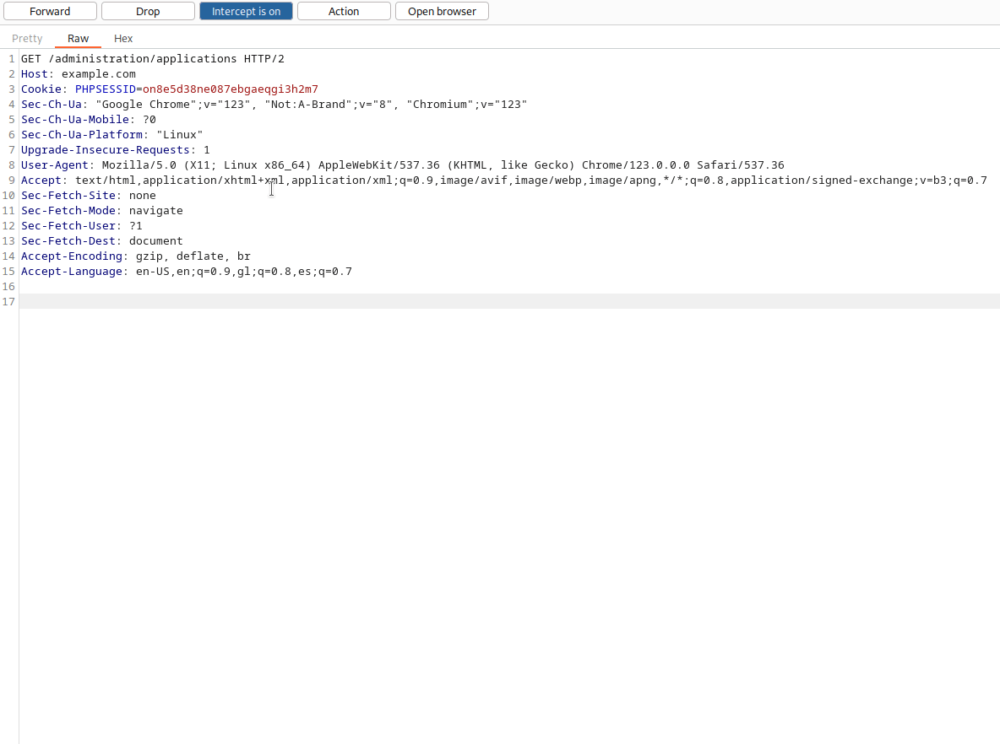
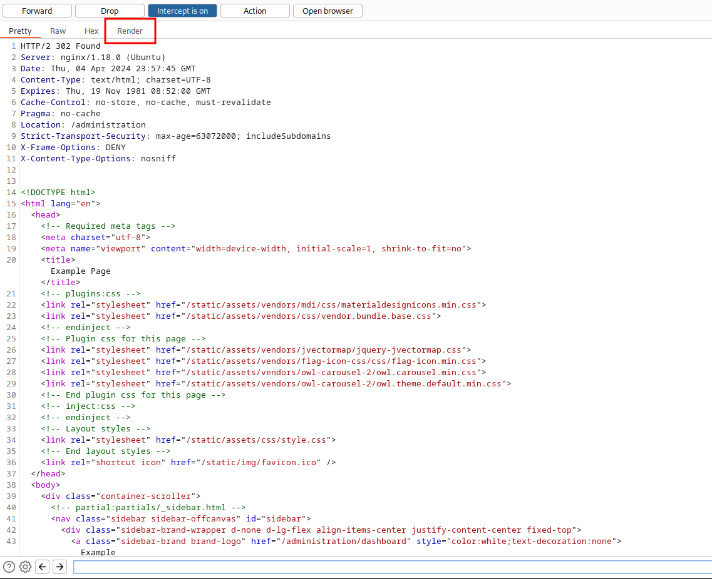
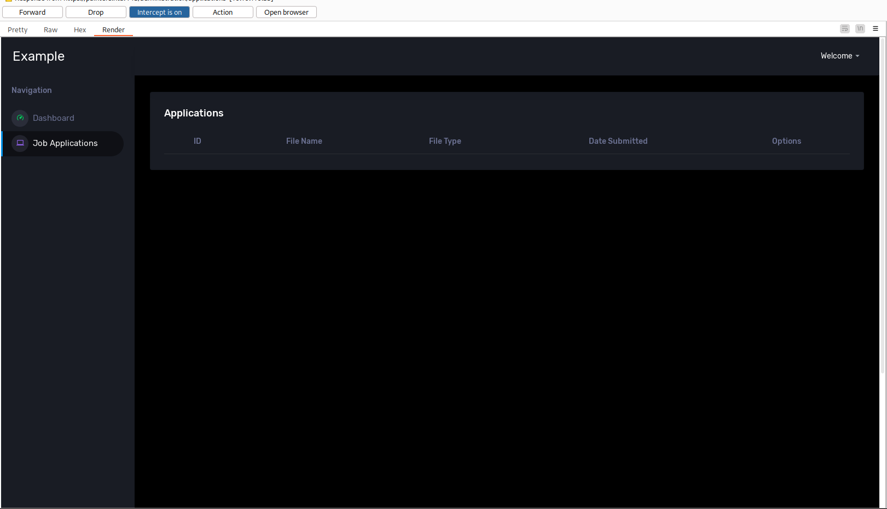
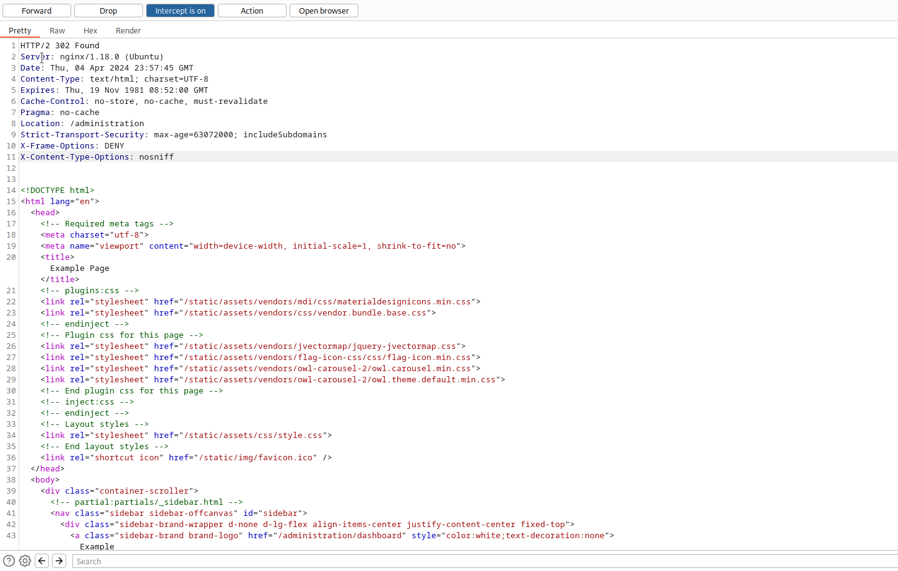
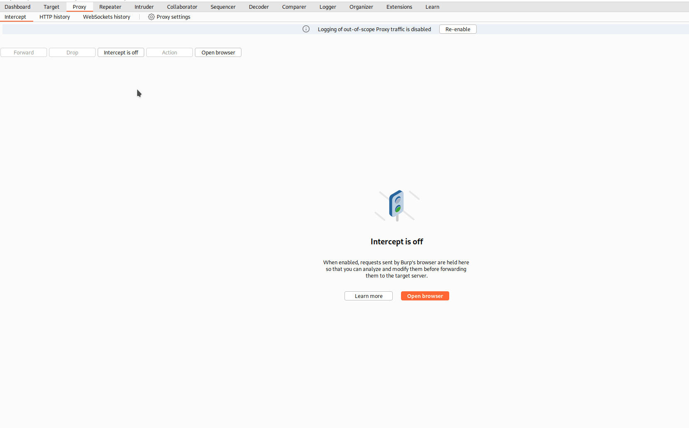

Imagine we found an application where we try to access the Admin Panel and we receive a `302 Found`. In this case, you can try to change the response to `200 OK`.

### Example Scenario

While fuzzing, we found that `https://example.com/administration/applications` give us `302 Found`. If we go there, it will redirect us to `https://example.com/login`, but what happens if we intercept this request? Let's see

Forward the request, and now you will see the response entirely. We can click on **Render** so it will show us how the page look like.

As you can see, the response show us the Admin panel, we can now change `302 Found` to `200 OK`.

We can see now the entire Admin panel, but take into consideration that this is a **Client Side Attack**. If we try to make a request it will redirect us back to the login panel. To avoid this, we can make a **Match and Replace** rule, which will make the bypass automatically.

We can now click on anything, and the page won't redirect us back to the login page.