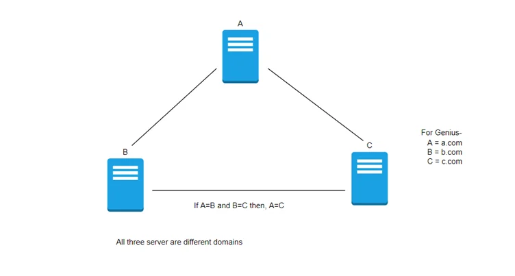

## Domain Trusts Overview

A [trust](https://social.technet.microsoft.com/wiki/contents/articles/50969.active-directory-forest-trust-attention-points.aspx) is used to establish forest-forest or domain-domain (intra-domain) authentication, which allows users to access resources in (or perform administrative tasks) another domain, outside of the main domain where their account resides. A trust creates a link between the authentication systems of two domains and may allow either one-way or two-way (bidirectional) communication. An organization can create various types of trusts:

- `Parent-child`: Two or more domains within the same forest. The child domain has a two-way transitive trust with the parent domain, meaning that users in the child domain `corp.inlanefreight.local` could authenticate into the parent domain `inlanefreight.local`, and vice-versa.
- `Cross-link`: A trust between child domains to speed up authentication.
- `External`: A non-transitive trust between two separate domains in separate forests which are not already joined by a forest trust. This type of trust utilizes [SID filtering](https://www.serverbrain.org/active-directory-2008/sid-history-and-sid-filtering.html) or filters out authentication requests (by SID) not from the trusted domain.
- `Tree-root`: A two-way transitive trust between a forest root domain and a new tree root domain. They are created by design when you set up a new tree root domain within a forest.
- `Forest`: A transitive trust between two forest root domains.
- [ESAE](https://docs.microsoft.com/en-us/security/compass/esae-retirement): A bastion forest used to manage Active Directory.

When establishing a trust, certain elements can be modified depending on the business case.

Trusts can be transitive or non-transitive.

- A `transitive` trust means that trust is extended to objects that the child domain trusts. For example, let's say we have three domains. In a transitive relationship, if `Domain A` has a trust with `Domain B`, and `Domain B` has a `transitive` trust with `Domain C`, then `Domain A` will automatically trust `Domain C`.
- In a `non-transitive trust`, the child domain itself is the only one trusted.



Trusts can be set up in two directions: one-way or two-way (bidirectional).

- `One-way trust`: Users in a `trusted` domain can access resources in a trusting domain, not vice-versa.
- `Bidirectional trust`: Users from both trusting domains can access resources in the other domain. For example, in a bidirectional trust between `TRUSTED.LOCAL` and `PAINTERS.LOCAL`, users in `TRUSTED.LOCAL` would be able to access resources in `PAINTERS.LOCAL`, and vice-versa.

## Enumerating Trust Relationships

We can use the [Get-ADTrust](https://docs.microsoft.com/en-us/powershell/module/activedirectory/get-adtrust?view=windowsserver2022-ps) cmdlet to enumerate domain trust relationships. This is especially helpful if we are limited to just using built-in tools.

### Using Get-ADTrust

```powershell
PS:\> Import-Module activedirectory
PS:\> Get-ADTrust -Filter *

Direction               : BiDirectional
DisallowTransivity      : False
DistinguishedName       : CN=INTERNAL.TRUSTED.LOCAL,CN=System,DC=TRUSTED,DC=LOCAL
ForestTransitive        : False
IntraForest             : True
IsTreeParent            : False
IsTreeRoot              : False
Name                    : INTERNAL.TRUSTED.LOCAL
ObjectClass             : trustedDomain
ObjectGUID              : f48a1169-2e58-42c1-ba32-a6ccb10057ec
SelectiveAuthentication : False
SIDFilteringForestAware : False
SIDFilteringQuarantined : False
Source                  : DC=TRUSTED,DC=LOCAL
Target                  : INTERNAL.TRUSTED.LOCAL
TGTDelegation           : False
TrustAttributes         : 32
TrustedPolicy           :
TrustingPolicy          :
TrustType               : Uplevel
UplevelOnly             : False
UsesAESKeys             : False
UsesRC4Encryption       : False

Direction               : BiDirectional
DisallowTransivity      : False
DistinguishedName       : CN=PAINTERS.LOCAL,CN=System,DC=TRUSTED,DC=LOCAL
ForestTransitive        : True
IntraForest             : False
IsTreeParent            : False
IsTreeRoot              : False
Name                    : PAINTERS.LOCAL
ObjectClass             : trustedDomain
ObjectGUID              : 1597717f-89b7-49b8-9cd9-0801d52475ca
SelectiveAuthentication : False
SIDFilteringForestAware : False
SIDFilteringQuarantined : False
Source                  : DC=TRUSTED,DC=LOCAL
Target                  : PAINTERS.LOCAL
TGTDelegation           : False
TrustAttributes         : 8
TrustedPolicy           :
TrustingPolicy          :
TrustType               : Uplevel
UplevelOnly             : False
UsesAESKeys             : False
UsesRC4Encryption       : False
```

The above output shows that our current domain `TRUSTED.LOCAL` has two domain trusts. The first is with `INTERNAL.TRUSTED.LOCAL`, and the `IntraForest` property shows that this is a child domain, and we are currently positioned in the root domain of the forest. The second trust is with the domain `PAINTERS.LOCAL,` and the `ForestTransitive` property is set to `True`, which means that this is a forest trust or external trust. We can see that both trusts are set up to be bidirectional, meaning that users can authenticate back and forth across both trusts. This is important to note down during an assessment. If we cannot authenticate across a trust, we cannot perform any enumeration or attacks across the trust.

Aside from using built-in AD tools such as the Active Directory PowerShell module, both PowerView and BloodHound can be utilized to enumerate trust relationships, the type of trusts established, and the authentication flow. After importing PowerView, we can use the [Get-DomainTrust](https://powersploit.readthedocs.io/en/latest/Recon/Get-DomainTrust/) function to enumerate what trusts exist, if any.

### Checking for Existing Trusts using Get-DomainTrust

```powershell
PS:\> Get-DomainTrust 

SourceName      : TRUSTED.LOCAL
TargetName      : INTERNAL.TRUSTED.LOCAL
TrustType       : WINDOWS_ACTIVE_DIRECTORY
TrustAttributes : WITHIN_FOREST
TrustDirection  : Bidirectional
WhenCreated     : 11/1/2021 6:20:22 PM
WhenChanged     : 2/26/2022 11:55:55 PM

SourceName      : TRUSTED.LOCAL
TargetName      : PAINTERS.LOCAL
TrustType       : WINDOWS_ACTIVE_DIRECTORY
TrustAttributes : FOREST_TRANSITIVE
TrustDirection  : Bidirectional
WhenCreated     : 11/1/2021 8:07:09 PM
WhenChanged     : 2/27/2022 12:02:39 AM
```

PowerView can be used to perform a domain trust mapping and provide information such as the type of trust (parent/child, external, forest) and the direction of the trust (one-way or bidirectional). This information is beneficial once a foothold is obtained, and we plan to compromise the environment further.

### Using Get-DomainTrustMapping

```powershell
PS C:\htb> Get-DomainTrustMapping

SourceName      : TRUSTED.LOCAL
TargetName      : INTERNAL.TRUSTED.LOCAL
TrustType       : WINDOWS_ACTIVE_DIRECTORY
TrustAttributes : WITHIN_FOREST
TrustDirection  : Bidirectional
WhenCreated     : 11/1/2021 6:20:22 PM
WhenChanged     : 2/26/2022 11:55:55 PM

SourceName      : TRUSTED.LOCAL
TargetName      : PAINTERS.LOCAL
TrustType       : WINDOWS_ACTIVE_DIRECTORY
TrustAttributes : FOREST_TRANSITIVE
TrustDirection  : Bidirectional
WhenCreated     : 11/1/2021 8:07:09 PM
WhenChanged     : 2/27/2022 12:02:39 AM

SourceName      : PAINTERS.LOCAL
TargetName      : TRUSTED.LOCAL
TrustType       : WINDOWS_ACTIVE_DIRECTORY
TrustAttributes : FOREST_TRANSITIVE
TrustDirection  : Bidirectional
WhenCreated     : 11/1/2021 8:07:08 PM
WhenChanged     : 2/27/2022 12:02:41 AM

SourceName      : INTERNAL.TRUSTED.LOCAL
TargetName      : TRUSTED.LOCAL
TrustType       : WINDOWS_ACTIVE_DIRECTORY
TrustAttributes : WITHIN_FOREST
TrustDirection  : Bidirectional
WhenCreated     : 11/1/2021 6:20:22 PM
WhenChanged     : 2/26/2022 11:55:55 PM
```

From here, we could begin performing enumeration across the trusts. For example, we could look at all users in the child domain:

### Checking Users in the Child Domain using Get-DomainUser

```powershell
PS C:\htb> Get-DomainUser -Domain INTERNAL.TRUSTED.LOCAL | select SamAccountName

samaccountname
--------------
Administrator
Guest
lab_adm
krbtgt
```

We can also use BloodHound to visualize these trust relationships by using the `Map Domain Trusts` pre-built query.